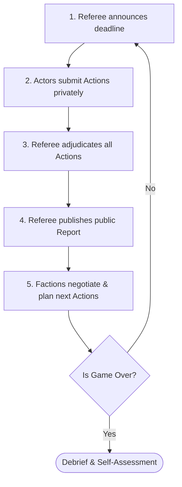
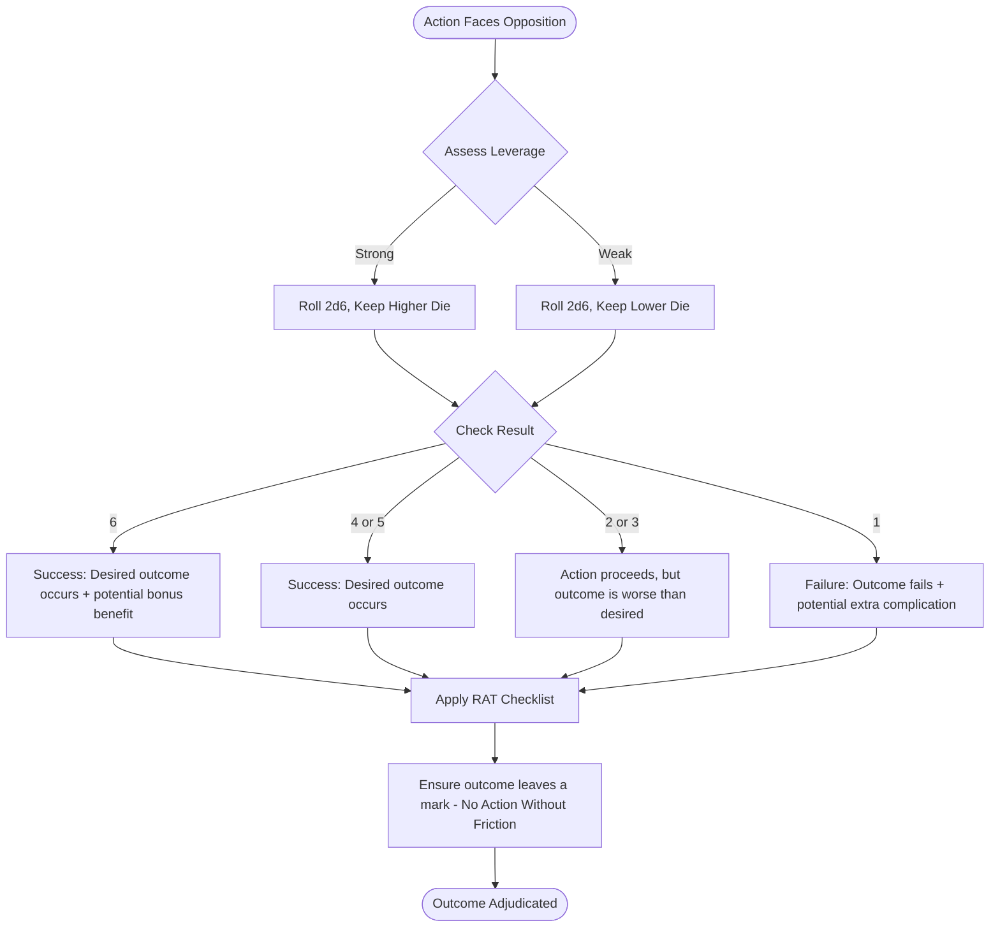

# Introduction

Open Strategy Games sit between wargames and role-playing games, but they are not a blend in the casual sense.

From wargames they take factional conflict, strategic stakes, and turn structure; from role-playing games they take open-ended action and play within a fictional world.

What they leave behind is just as important: they do not rely on dense combat procedures, and they do not center a single protagonist moving through a referee-authored narrative.

In an OSG, you play a faction.

You receive a brief that tells you what you want, what leverage you hold, and why the scenario matters to you.

Then, turn by turn, you act: one action at a time, in a world that changes in response to what everyone else is doing.

This handbook treats OSG not as a rigid definition but as a playable design framework.

The common structure is simple: a shared problem, asymmetric factions, private action submission, referee adjudication, public reports, and a debrief in which players assess what they achieved.

Within that structure, scenarios can vary widely in genre, scale, and texture.

The aim is not to simulate everything.

The aim is to create a game in which strategy emerges from position, action, and consequence rather than from optimizing against a closed menu of moves.

An OSG works when players are free to attempt what makes sense, when the referee can answer those attempts consistently, and when every result leaves the world more changed and more contested than before.

# Part I: Practice (How to Play and Run)

# Chapter 0: What Is an OSG

## Origins

In 2021, two designers found themselves running the same kind of game under different names. Chris McDowall called his *Sunrise Expansion* a Matrix Game. Sam Doebler ran a similar game set in the fantasy kingdom of Landover. When they talked about using the term "open strategy games" to describe both, they were recognizing that something distinct had emerged from the wargaming tradition, something that needed a name that didn't require twenty minutes of disambiguation. "Matrix Game" confused people who thought of *The Matrix*. "OSG" said what the thing actually was. The term, the design framework, and the foundational examples that inform this handbook trace back to Chris McDowall (*Sunrise Expansion*, bastionland.com) and Sam Doebler (*Landover*).

The lineage runs deeper. Matrix Games were originated by American designer Chris Engle in the late 1980s and developed through military education and wargaming communities over the following decades. The form most directly ancestral to OSG was shaped by British Army designer Major Tom Mouat, whose published practical guidance and workshop facilitation methods established the design conventions (argue for outcomes, qualify leverage, referee assesses) that McDowall and Doebler inherited and adapted. The core mechanic survived the translation into entertainment intact: declare an action, support it with reasons, let a referee determine what happens. What OSG stripped away was the professional-training scaffolding: the Greek choruses of subject-matter experts, the DIME frameworks, the formal probability tables. What remained was the game.

*Sunrise Expansion* was the founding example. A corporate dispute in near-future space. Six factions with asymmetric leverage. Six turns. The name "open strategy game" appeared in the referee's notes before it appeared anywhere else, as a description of what this thing was that didn't quite fit existing categories.

## How OSG Differs

**From wargames.** Traditional wargames resolve conflict through rules systems: hex-and-counter mechanics, attack tables, dice modifiers by unit type. Outcomes are calculated, not argued. An OSG has no combat resolution system. A military campaign is adjudicated the same way as a diplomatic initiative: declare an action, provide leverage, let the referee assess. The map is a surface for argument, not a calculation space. There are no rules about zone of control, flanking bonuses, or supply lines; only the internal logic of the fiction.

**From role-playing games.** In an RPG, you play a character, a single perspective moving through a world the game master creates and controls. In an OSG, you play a faction. There is no game master fiction; the referee adjudicates rather than narrates. There is no single protagonist; all players act in parallel, shaping a world that none of them controls. The game ends after a set number of turns and players assess whether they achieved their objectives. There is no ongoing campaign, no character advancement, no arc that belongs to any one player.

What OSG shares with RPG is tactical infinity: you can attempt anything. What it shares with wargame is competitive factional stakes and a structured turn sequence. It lives in the overlap, recognizable to players of either form, identical to neither.

## The Expectations Formula

*Sunrise Expansion* opened every game with this statement:

> **The goal of the game is to achieve your objectives.**  
> **The point of the game is to create a credible narrative.**

These two sentences encode the complete design philosophy. You should be trying to win: pursuing objectives, building leverage, outmaneuvering rivals. But you are simultaneously playing to find out what happens. A player who sacrifices their own objectives to make the narrative more interesting is playing correctly. A player who exploits a rules gap to achieve their objectives through means that collapse the fiction is playing incorrectly.

Play to win. Play to find out. Both at once, all game.

## Vocabulary

The terms below appear throughout this handbook. Each has an equivalent in traditional Matrix Game literature; the OSG versions are used here throughout.

**Actor.** A faction controlled by a single player. Equivalent to "player" in traditional Matrix Games; Actor foregrounds the role-play dimension.

**Referee.** The person who adjudicates actions, writes reports, and runs the scenario. Equivalent to Facilitator or Umpire.

**Action.** The specific course of conduct an Actor pursues this turn. Equivalent to "Argument" in classical Matrix Game literature, but narrower: an Action describes what you do, not a claim about the world.

**Outcome.** The result the Actor wants from their Action. Declared by the Actor before dice are rolled; the referee determines whether it occurs.

**Leverage.** The reasons an Action is likely to succeed: resources, relationships, positioning, established fiction. Replaces the classical "three reasons why" with a qualitative assessment.

**Brief.** The document given to each Actor detailing their Objectives and starting Position. Contains public information shared with all players and private information seen only by the Actor.

**Objectives.** What an Actor is trying to accomplish over the course of the game. Written into the Brief and self-assessed at game end.

**Position.** An Actor's starting configuration (resources, relationships, territory) as it is especially significant relative to other Actors. Not an inventory; only what matters for play.

**Turn.** One full cycle of play: Actions submitted, adjudicated, Report published.

**Report.** The public document the Referee produces at the end of each Turn, summarizing outcomes and seeding hooks for the next round.

## How a Session Feels

You receive a Brief. It tells you who you are, what leverage you hold, and what you are trying to achieve. The problem is stated in a single sentence: a crisis that will clearly affect every faction at the table, but in different ways, for different reasons, with different stakes.

In the first turn you move carefully. You probe: establish a foothold, signal an intent, feel out potential allies. Then the Report arrives. Three things happened that you didn't predict. One player did something you need to respond to immediately. Another did something that, if left unchecked, makes your long-term objective unreachable. A third did something that might be an invitation to cooperate, or a trap.

You have one action.

By the middle of the game, alliances have formed and fractured. The world looks different from the one described in the Brief: decisions have accumulated, unexpected consequences have compounded, and the problem that started the game has transformed into something none of the factions could have anticipated. What you are fighting for may still be what you started with, or it may have evolved in response to a world that evolved first.

The game ends. You say whether you achieved your objectives. So does everyone else. The conversation that follows, about what actually happened, why it happened that way, and what you would do differently, is often the best part of the whole experience.

*Part I covers how the game is played: the turn structure, adjudication, reports, roles, and the debrief. Part II covers how it is designed: scenario construction, faction design, briefs, maps, and scaling. The chapters can be read in order or used as reference.*

# Chapter 1: The Turn in Detail

Every action an Actor submits follows the same three-part structure:

**Action:** What specifically are you doing?  
**Outcome:** What is your desired result?  
**Leverage:** What makes this action possible, and the outcome probable?

This format does four things:

1.  It forces the Actor to commit to a specific course of conduct rather than a vague intention.
2.  It separates what you're doing from what you want to happen; the referee adjudicates the outcome, not just the action.
3.  It requires the Actor to think about why their plan should work before the referee has to assess it.
4.  It gives the referee enough information to adjudicate consistently and write a traceable report afterward.

**A filled-in example:**

> **Action:** Send a formal notice of debt review to Caldrath's treasury, citing the emergency clause in our lending agreements.  
> **Outcome:** Delay Caldrath's army movement by forcing their treasury into a liquidity assessment before any major campaign expenditure can be authorised.  
> **Leverage:** Caldrath's military expansion over the past decade was financed by Meranto loans. The emergency clause exists, has precedent, and their treasury minister knows invoking it freezes discretionary spending for thirty days. We hold documentation for every transaction.

This example shows how leverage works: not a list of credentials, but a specific argument for why this action is likely to produce this outcome given this fictional context. More on leverage in Chapter 2.

> Action template
>
> Actor: (your faction) Turn: (turn number)
>
> Action: What specifically are you doing?
>
> Outcome: What result do you want from this action?
>
> Leverage: Why is this action likely to produce that outcome? Ground it in established fiction: resources, relationships, position, prior actions.

## Private Submission

Actions are sent directly to the referee, not posted in the public channel.

There are several reasons for this:

1.  It prevents reactive play that would otherwise dominate: if players see each other's actions before submitting their own, they will simply counter whatever the most threatening player does, rather than pursuing their own agenda.
2.  It allows the referee to adjudicate the full turn before any outcomes are public, preventing the chaos of players treating half-reported results as established fact.
3.  It keeps genuinely secret operations secret until the referee decides how much to reveal in the public report.

Private submission is not about deception for its own sake. It is about creating a space where players commit to their plans based on their best read of the situation, rather than optimizing reactively against what others have already announced.

## The Single Action

Each Actor submits one action per turn. One.

This rule comes from the game's origins in military training, where it was designed to force participants to prioritize: to identify what they absolutely need to do *right now*, this turn, given their position and objectives. That purpose translates directly to entertainment play. If every Actor can do everything at once, the game collapses into a sequence of simultaneous all-fronts pushes that leave no room for strategic vulnerability, alliance negotiation, or meaningful sacrifice.

The single action rule is also a gift to the referee. Adjudicating six to eight complex actions per turn is already substantial work. Secondary and tertiary actions per Actor would make the referee's task unmanageable and the report incoherent.

The temptation to squeeze two things into one Action is constant and should be resisted. "Launch an attack on the embassy *and* establish a spy network in the capital" is not one action. If a player submits something that is clearly two actions, the referee should return it and ask which one matters more. The choice of what to prioritize is part of the game.

Variant: Some OSG implementations allow a leader action or secondary action per turn alongside the main faction action (see the BLOC variant in Appendix A). This increases complexity for both players and referee. It is not recommended for first games.

## Talking Is a Free Action

Actors can communicate with each other freely, at any time, about anything. Negotiating an alliance does not cost your turn. Sharing intelligence does not cost your turn. Warning another faction that you intend to act against them does not cost your turn.

This enables the full range of political play, dealmaking, bluffing, coalition-building, threats, and betrayals, without requiring players to spend their precious single action on communication. It means that turns can be filled with activity that does not appear in the public report and that the referee never sees: private negotiations that succeed, fail, or become leverage in ways the referee learns about only through subsequent actions.

The limit is what you actually *do*. Talking about building a fleet is free. Building the fleet costs a turn.

*This principle is drawn directly from the Guiding Principles in Sam Doebler's OSG design writing, where it appears as a foundational rule of play.*

## The Report Cycle

A single turn runs as follows:

1.  The referee announces the submission deadline.
2.  Actors submit their Actions privately before the deadline.
3.  The referee adjudicates all Actions (see Chapter 2).
4.  The referee publishes a public Report detailing outcomes.
5.  Actors have a defined window to submit their next Action.
6.  Repeat until the game ends.



The Report is the heartbeat of the game. Between deadline and Report, the game is dark: players have committed their plans and can do nothing but wait. The Report breaks the silence: this is what happened, this is the world as it now stands, here is what you have to respond to.

The quality of the Report determines whether the next turn is rich or thin. A good Report gives every Actor something to act on (see Chapter 3).

## Timing

For asynchronous play, the most common format for online OSGs, a 48-hour window from Report publication to action submission is a practical default. This gives players enough time to read the report, think through their position, negotiate with other Actors, and draft a considered action without the game losing momentum.

What happens when a player misses the deadline? The least disruptive option is a one-turn pass: the Actor takes no action, and the world moves without them. A more generative option is a referee-authored holding action, something plausible and low-stakes that keeps the faction present in the report. Either way, the policy should be stated before the game begins.

For in-person or live online play, turns run in real time. Actions may be submitted simultaneously with a brief deliberation window, or sequentially around the table. The single-action discipline and private submission rules still apply; the timing window simply compresses from days to minutes.

# Chapter 2: Adjudication

In classic Matrix Game theory, adjudication happens publicly: all players hear the declared Action, argue for and against it, and the facilitator assesses probability based on the weight of arguments. This system has genuine value; it keeps everyone engaged, builds shared understanding of the fiction, and surfaces subject-matter expertise when the game is being used for analysis.

For recreational OSG, especially in asynchronous formats, it is rarely the right choice.

When players publicly argue the merits of each other's actions before adjudication, two things happen. First, it creates a meta-game in which the socially dominant players win more arguments regardless of fictional merit. Second, it slows the game to a crawl. In an async game with six players across multiple timezones, a public argument phase before every action would mean turns measured in weeks rather than days.

The OSG model favors what Chris McDowall called Benevolent Dictatorship: one referee, full authority, no public argument. The referee reads the submitted Action, assesses it against the established fiction, and rules.

The trade-off is real. Players trust the referee to be fair, and the referee must earn that trust by being consistent, explaining outcomes in the report, and never letting their own preferences about how the story should go influence adjudication of how a player's action was likely to succeed. The upside is a game that moves and a referee who can adjudicate creatively without getting talked out of interesting outcomes by the loudest voice at the table.

## Leverage: Strong and Weak

When an Action faces opposition, from another Actor's action, from established fiction, from a hostile NPA, the referee grades the submitting Actor's leverage as **Strong** or **Weak** relative to that opposition.

Strong leverage does not mean overwhelming leverage. It means the Actor has established enough to reasonably tip the balance in their favor. Relevant factors include:

-   Resources explicitly established in the Actor's position or acquired during play
-   Relationships that have been built through prior actions
-   Geographic or positional advantage that the fiction supports
-   Prior actions that created the conditions for this one to succeed
-   The plausibility of the argument in the context of the established world

Weak leverage means the Actor is attempting something plausible but without a strong basis for expecting success. This might be an action against a well-established opponent, an action using resources that are thin or uncertain, or an action in a domain where the Actor has no established presence.

The referee is not scoring a debate. They are asking: given what is established in the fiction, does this Actor have enough of an advantage that I'd expect them to succeed more often than not? If yes, Strong. If not, Weak.

## Unopposed Actions

Not all Actions face opposition. An Actor building a communication network in territory they control, with established infrastructure and no competing faction attempting to interfere, has an Unopposed action.

Unopposed does not mean free. It does not mean automatic success without consequence. It means the Actor gets their desired Outcome, but the referee still determines how that outcome lands in the world.

Every decision should leave a mark. A communication network successfully established is a fact that other Actors now have to contend with. The referee writes this into the report in a way that creates hooks: who notices, who is threatened, what becomes possible or impossible as a result. An Unopposed success is not an off-turn. It is a successful action that still reshapes the board.

## The Dice Mechanic

When an Action faces opposition, the referee rolls two six-sided dice.

-   If the Actor's leverage is **Strong**, keep the **high die**.
-   If the Actor's leverage is **Weak**, keep the **low die**.

**4–6:** The desired outcome occurs. On a 6, something especially good for the Actor may also occur.  
**1–3:** The action proceeds, but the outcome is worse than desired. On a 1, something especially bad may also occur.



This mechanic is deliberately simple. It preserves narrative bias, the action is certain to proceed in some form, outcomes are variable, without the complexity of modifier stacking. A +2 modifier on a 2d6 system produces results that are technically more precise but require a probability table to interpret intuitively. Keep-high or keep-low is immediately comprehensible: strong leverage gives you a good shot, weak leverage gives you a poor one.

The mechanic also resists the temptation to treat adjudication as arithmetic. A referee who reaches for a specific modifier for every factor in an action will produce inconsistent results because the factors resist exact commensuration. The qualitative assessment, strong or weak, requires judgment but rewards it.

## Force of Nature

When both dice show the same number, the referee may introduce a Force of Nature: a chaotic event originating outside any player's influence that complicates the situation.

This is a prompt, not a requirement. If the narrative context makes a Force of Nature fitting, use it. If nothing comes to mind, ignore the doubles and apply the standard outcome.

Good Forces of Nature are unpredictable but not arbitrary. They emerge from existing threads in the fiction: a storm that was mentioned in the brief, a political crisis that has been building in reports, a technology failure that has been foreshadowed. They create problems for everyone rather than gifting one Actor and punishing another. They open new possibilities rather than simply adding damage.

Use Forces of Nature sparingly. A world with chaotic external events every other turn becomes unmanageable. Once or twice per game, when the narrative supports it and the opportunity is genuinely interesting, is about right.

## The RAT Checklist

Before writing any outcome, success or failure, the referee should check it against three criteria:

**Reasonable.** Is this outcome proportionate and fair? Does it feel like something that would actually happen given what the fiction has established? An outcome that punishes an Actor far beyond what the action warrants, or rewards them far beyond what the leverage supports, fails this test.

**Actionable.** Does this outcome create hooks for future play? Does it leave something for other Actors to respond to, an opportunity to exploit, a problem to address? An outcome that is narratively satisfying but leaves the table directionless has failed this test. Every success should put something in front of other players; every failure should open a door even as it closes another.

**Traceable.** Can you point to earlier events in the fiction that led to this outcome? Does the result feel like a consequence of decisions already made, rather than something that came from nowhere? If a Senator turns out to be a traitor, was his name at least mentioned in a prior report? Traceability keeps the game's causality coherent and rewards players who have been paying attention.

> RAT: quick check
>
> Reasonable: proportionate to the action and the fiction? Actionable: does it leave at least one hook for another Actor? Traceable: can you point to an earlier event that led here?

A worked example: Essaveth attempts to establish a secret communication channel to Saivorn, bypassing Caldrath's intelligence network.

-   *Reasonable:* Essaveth has established diplomatic contacts with Saivorn through the old treaty framework and plausible motivation to seek a commercial partner who isn't a military threat. A secret channel is not implausible. ✓
-   *Actionable:* A private Essaveth-Saivorn relationship is a fact that will matter, to Caldrath (who needs Essaveth's passes), to the Conclave (who ratified all prior agreements), potentially to House Meranto (who holds both factions' debts). It creates a visible thread even if the content stays private. ✓
-   *Traceable:* In Turn 1, Essaveth took an action to reach out to non-military factions, which partially succeeded. That earlier action makes this one logically downstream. ✓

The outcome passes. Write it.

## No Action Without Friction

The doctrine: every outcome, successful or not, leaves a mark on the world.

A successful coup attempt eliminates a rival, and creates a power vacuum that other Actors will race to fill. A successful diplomatic agreement achieves its purpose, and signals to excluded parties that their position has weakened, prompting them to act. Even a quiet, unopposed action that succeeds exactly as planned has consequences: relationships shift, information propagates, positions change.

Friction is not the same as a hurdle. A hurdle blocks an action: "you can't do this." Friction complicates an action: "you can do this, but it costs something." Hurdles are referee veto by another name. Friction is a richer outcome than simple success.

The practical implication: if you are about to write an outcome that is wholly positive with no complicating consequence, pause. Ask what mark this action leaves on the world. Ask who notices. Ask what becomes harder or more contested as a result. The answer to those questions belongs in the report.

The same doctrine applies to failures. When a player's leverage is weak but their action is narratively compelling, bold, plausible, and rich with implication, the failure should be written with the same care as a success. A weak-leverage failure that produces three hooks is better for the game than a strong-leverage success that produces one. The referee's job in writing a failure is not to close a door; it is to open a different one. What did the attempt reveal? Who noticed? What is now in motion that wasn't before? A failure that answers those questions is friction. A failure that merely says "it didn't work" is a dead end.

## Anti-Patterns

**Unactionable leverage.** A player submits leverage that is too vague, too circular, or too detached from the fiction to support adjudication. "We have superior technology" with no prior fictional grounding for what that technology is or does. "Our resources are vast" without specifying what resources are being deployed. This is not leverage; it is assertion. The referee should return the action and ask the player to ground their argument in established facts. Accepting vague leverage degrades the fiction for everyone.

**Over-lenient adjudication.** The referee lets actions go through "too smoothly," accepting weak leverage as sufficient, granting Unopposed status to actions that have clear narrative opposition, writing outcomes that are entirely positive without friction. This usually happens when the referee is conflict-averse: they don't want players to feel punished. The result is a game where nothing is at stake, because everything works. The fiction stops generating tension. The right correction is not to become punitive, but to apply "No Action Without Friction" consistently.

**Over-harsh adjudication.** The referee blocks rather than complicates. Instead of friction, hurdles. Instead of messy success, failure without a forward path. Over-harsh adjudication usually comes from the referee protecting their vision of how the story should go, or from an overcorrection after a period of being too lenient. Players who are repeatedly blocked with no way forward stop investing in the game. The fix is to replace "no" with "yes, but," not capitulating to player intent, but always leaving a door open somewhere.

# Chapter 3: The Report

The Report does two things simultaneously: it chronicles what happened, and it re-seeds the game.

Chronicle function: after every Actor has committed their action in the dark and the referee has adjudicated, the Report is where the world becomes visible again. Players learn what happened, what succeeded, what failed, what they couldn't have predicted. It is the authoritative record of the game's accumulating fiction.

Re-seeding function: a Report that only records is a dead document. A Report that records and then puts something in front of each player, a new problem, an open question, a tempting opportunity, a visible threat, is the engine that drives next-turn decisions. Think of writing the Report the same way you think of writing the initial Brief: your job is to draw players in.

These two functions are in tension. Chronicle demands completeness; re-seeding demands economy. Resolve the tension by keeping the Report brief and pointed, not by sacrificing either goal.

## Style and Tone

Write the Report in the style of a news roundup. Brief, factual, third-person. Describe what happened, not why the referee decided it happened that way. Do not narrate your adjudication reasoning. Players see "The Conclave formally claimed ratification authority over any successor treaty and met with resistance from Caldrath's representatives, though the claim itself now stands as public record" in the report, not the adjudication reasoning behind it: "The Conclave's action had strong leverage due to their institutional authority, which I assessed as outweighing Caldrath's opposition, resulting in a 5 on the die."

The referee's reasoning belongs in private feedback to the Actor, not in the public record. The public record is the world as it exists, not an explanation of how it came to be.

Write short. Longer reports get skimmed. A report with eight short paragraphs, one per Action, with a brief observation at the end, is better than a three-page narrative recap that buries the hooks.

> Example report: Turn 3, The Corentine Succession
>
> The Conclave formally claimed ratification authority over any successor treaty at a public session in Corenth on the 12th. Caldrath's representatives objected and withdrew. The claim stands as public record regardless. ← outcome stated as fact; no adjudication reasoning
>
> House Meranto's debt review notice against Caldrath's treasury has entered its second week. Caldrath has not responded publicly. Three Meranto agents were observed near the northern garrison road on the 14th. ← private outcome partially surfaced as a traceable crumb; the agents are now a public fact
>
> Essaveth closed the northern passes to unsanctioned military movement late on the 13th. A small Caldrath advance unit turned back without incident. The passes remain open to commercial traffic. ← outcome with friction; Caldrath did not get what it wanted, but the door is not closed
>
> The peninsula is watching Caldrath. Whatever they do next, they will do it visibly. ← closing observation; open thread not owned by any single Actor

## Hook-Seeding

After each outcome, ask: what does this create for other players? Then write at least one thing they can act on.

The successful espionage operation notes not just the success, but also that a rival faction's financial records are now being examined and that several transactions trace to a surprising third party. That last detail is the hook. You are not obligated to explain what it means. In fact, unexplained details are better hooks than explained ones, because they invite interpretation and action rather than just acknowledgment.

Fill the Report with hooks the way you fill the initial Brief with problems. Even if players don't act on most of them, a dense Report gives every Actor at least one thing worth responding to.

## Private Outcomes and Traceable Crumbs

Some Actions have outcomes that should not be fully public. A covert operation that succeeds is reported privately to the Actor. A spy inserted into an enemy faction is not announced.

But no secret is perfect. For every private outcome, plant a traceable crumb in the public report.

> *"A previously unknown Meranto representative was observed attending the Conclave's closed session in Corenth."*

The Meranto representative was just introduced to the public report. Their presence, the closed session, these are facts now. When they turn out to be the conduit for a private debt restructuring deal in three turns, the table can look back and see that they were always there. The game remains coherent; the revelation feels earned.

The crumb should be small enough not to give away the secret, but specific enough that a careful reader would notice it. The RAT principle applies here especially to Traceability: the referee plants seeds in reports that make later revelations feel inevitable rather than arbitrary.

When you are unsure what crumb to leave, default to a proper name and an observation. A person noticed. A meeting occurred. A shipment was delayed. These are events that could mean anything, until they mean something.

## RAT Applied to Reports

All three RAT criteria apply when writing outcomes into the report.

**Reasonable**: does the outcome as reported feel proportionate? Does it describe consequences that actually match the scale of the action?

**Actionable**: has the referee written the outcome in a way that gives other players something to do? A faction's secret military buildup should appear in the report as something, a rumor, a noticed pattern, a sudden shortage of certain materials, that other players can investigate or respond to.

The practical test: after writing any outcome, ask whether it puts something in front of at least one other player that they have a reason to respond to next turn. If the answer is no, the outcome is not yet Actionable, rewrite it before publishing the report. This test is worth running mechanically, every turn, until it becomes instinct. McDowall noted that Actionable was the hardest of the three criteria to apply consistently, even in his own practice; it is the one most likely to slip when the referee is moving fast.

**Traceable**: can a player look back at prior reports and see how today's events followed from earlier ones? Good reports build a chain of causality that makes the game feel like a coherent history rather than a sequence of disconnected events.

Traceability is the hardest criterion in reports. It requires the referee to remember what they have and haven't established, and to consciously build on prior details rather than inventing new ones. The discipline is worth developing: when the game ends and players reconstruct what happened, traceability is what makes the reconstruction satisfying.

# Chapter 4: Roles Beyond Actors

This chapter is for groups larger than eight players. If your game has five to eight Actors and no overflow, skip to Chapter 5.

## The Overflow Problem

A game designed for six Actors has twelve people who want to play. The instinctive response, add more Actors, is usually the wrong one.

The 5–8 Actor sweet spot exists for concrete reasons. The referee's report must cover every Actor's action each turn; beyond eight Actors, report length becomes unmanageable and coherence suffers. Alliances and rivalries require players to track other factions; beyond eight, the cognitive load exceeds what most players can sustain across a multi-turn game. The fiction itself degrades: with too many factions, no single faction has enough weight in the world to feel consequential. The sweet spot is not a soft preference; it is a structural limit.

But excluding players creates a different failure. A game with six Actors and six observers is not a game; it is a demonstration with an audience. Observers who are not participating have no investment in the outcome, no reason to follow the fiction carefully, and nothing to contribute to the debrief. Exclusion does not protect the game; it hollows it out socially while leaving the mechanical structure intact.

This chapter documents two solutions. The first is the **Consultant**: a named, practiced participation tier drawn directly from Sunrise Expansion, in which overflow players engage with the game through questions rather than actions. The second is the **team Actor**: a mechanic drawn from Mouat's practical guidance, in which multiple players share a single Actor role. A third section describes scenario-specific participation structures, participation modes built into a scenario's fiction rather than borrowed from a portable system.

This chapter does not document a complete sub-role system. The Consultant and team Actor are the two mechanisms with sufficient source grounding to be treated as established practice. Other patterns that appear in OSG discussions, collective factions, voting blocs, are scenario-specific designs, not portable sub-roles, and are not documented here as such.

## The Consultant

### Origin and Evidence

When Chris McDowall ran Sunrise Expansion, he created a participation role for players who were not assigned as Actors. Sam Doebler was one of them. His account is the only first-person description of the role in the OSG corpus:

> "As a Consultant, I get the option to ask the referee one question each turn. That's it. And it's VERY open-ended."

Doebler's evaluation of the experience was direct: he was more invested than a pure observer. The constraint, one question, open-ended, per turn, produced genuine engagement rather than the passive spectatorship that pure observation tends toward. McDowall designed the role specifically to include more people without expanding the Actor count, and it worked as intended.

The Consultant role has not been extensively documented since. What follows elaborates the mechanic from that original description and from the design logic it implies.

### The Mechanic

A Consultant submits one question to the referee per turn. No action. No leverage. No intended outcome. Just the question.

The question is open-ended by design. Because the Consultant has no objectives to protect and no faction to advance, their questions tend toward genuine curiosity rather than strategic probing. They want to understand the world, how something works, what a situation means, what the referee has established about a detail that other players may be too busy strategizing to notice.

The constraint is the mechanism. A Consultant who could ask unlimited questions would degrade the referee's working capacity without adding proportionate value. One question per turn forces a choice: out of everything the Consultant wants to know, what do they actually need to know most? That discipline produces better questions and a more engaged Consultant.

The referee answers at their discretion. They may answer fully, partially, or decline if answering would reveal another Actor's secrets or confer meaningful strategic advantage. A question that crosses into another Actor's private brief is not a Consultant question; it is an investigation, and investigations require an Action.

### What Consultants Cannot Do

The boundary between Consultant and Actor must be maintained clearly:

-   A Consultant cannot submit an Action.
-   A Consultant cannot provide leverage in support of another Actor's action.
-   A Consultant does not receive a private briefing and does not hold objectives.
-   A Consultant does not self-assess at game end in the same way as Actors, though they should participate in the debrief and their perspective on the game is worth hearing (see Chapter 5).

The Consultant is a participation tier, not a reduced Actor. Blurring the line creates a hybrid role with the costs of both and the benefits of neither. A Consultant who begins informally advising an Actor on strategy is no longer a Consultant; they are a second player on a team Actor without the structure that makes team Actors work. If that is what the group wants, assign them as a team Actor instead.

### When to Use It

**Overflow players who want light engagement.** Not every overflow player wants the full responsibility of an Actor role. The Consultant offers genuine participation without the strategic commitment and turn-by-turn pressure of playing a faction.

**New or hesitant players.** Someone new to OSG, or to this kind of game entirely, can engage meaningfully as a Consultant while building the context and confidence they need to play an Actor next time. The low-stakes participation is an on-ramp, not a consolation prize.

**Streaming and spectator contexts.** Doebler explicitly names this use case. If the game is being run publicly, at a convention, on stream, for an audience, Consultants drawn from that audience, rotating one per turn, keep spectators genuinely engaged rather than passively watching. The question they submit is a real contribution to the game; the answer they receive is information the whole audience shares.

**Subject-matter experts.** In games with real-world grounding, historical scenarios, political simulations, a Consultant who knows the domain can improve the fiction's plausibility by asking questions that surface inconsistencies or underdeveloped details. Their expertise serves the game without requiring them to play a faction.

### Public vs. Private Questions

The default: Consultant questions go to the referee privately, and answers are delivered at the referee's discretion, publicly, if the answer is world-clarification that benefits all players; privately, if the answer is more sensitive.

In streaming or convention contexts, making both questions and answers fully public can work well. The Consultant becomes a world-clarification mechanism for the whole table, surfacing information that players with strategic agendas might not think to ask for. The referee still retains discretion over what to answer; the public format simply means the exchange is visible rather than conducted in a side channel.

## The Team Actor

### The Mechanic

Two to three players share a single Actor. They deliberate among themselves and submit one Action per turn, speaking with one voice to the referee, the same as any solo Actor.

The maximum is three. Beyond three players on a single Actor, the internal deliberation becomes a game in itself: the time spent reaching agreement exceeds the time players have to think about the game's broader situation, and the Action that emerges tends to be over-compromised or late. Two players is the most common and most workable configuration. Three is viable when the Actor role is complex or when one of the three is new to the format.

### What It Produces

The deliberation between players moderates extreme positions. One player may read the current turn as an opportunity for an aggressive move; another may argue for patience. The negotiation between them tends to produce what Mouat calls "more mainstream" responses, not the outlier actions that collapse the fiction or overextend the faction beyond what its position can support, but the considered, plausible action that a real entity in that situation would most likely take.

This is not a bug. Outlier actions are among the most common ways that OSG fictions break down: a player, unrestrained, makes a move so extreme or so implausible that it strains the world's internal logic and forces the referee into an uncomfortable adjudication. The team Actor structure self-corrects for this at the player level, before the action reaches the referee.

The pairing of experienced and new players is a specific application worth naming. A new player who joins a team Actor with someone who has played before learns what kinds of leverage arguments work, what the single-action discipline actually feels like in practice, and how to read the report for things worth responding to, all before they have to do any of it alone. The team structure is an on-ramp that produces better solo players next time.

### What It Does Not Solve

The team Actor increases player count per Actor; it does not reduce Actor count or expand the Actor roster. It is a solution for distributing load and including overflow players who want full engagement, not for including participants beyond the scenario's designed Actor list.

It also does not work well for Actors whose design depends on internal information asymmetry. An Actor whose brief contains a secret that one team member should hold and the other should not creates an untenable situation: either both players know the secret, which changes the dynamic, or one player is running a sub-deception within the team, which is unmanageable. Keep team Actors on roles where shared knowledge is appropriate. If a role has secrets that need to stay secret within the team, it should be played solo.

### When to Use It

**Overflow players who want full Actor engagement.** Some overflow players do not want a reduced participation tier; they want to play the game fully. The team Actor gives them that without requiring the scenario to be redesigned.

**Demanding Actor roles.** If the scenario includes a role that is significantly more complex than the others, a mediating faction with relationships to every other Actor, a role with a multi-stage objective set, a faction whose starting position requires constant management, pairing a strong player with a newer one balances the load without weakening the role.

**Availability uncertainty.** A team Actor can cover for an absent player more plausibly than a solo Actor's absence. If one team member misses a turn, the other can still submit an Action. The faction remains present in the fiction. This is a practical resilience argument for team Actors in longer async games where dropout is a real risk.

## Scenario-Specific Participation

The Consultant and team Actor are portable mechanisms. They work across scenarios because they do not depend on any specific fictional premise; a Consultant is a Consultant in a space opera or a succession crisis, and a team Actor functions the same way in both.

But participation structure can also be built into the scenario's fiction rather than borrowed from a portable system. Dreaming Dragonslayer's published scenario sketches demonstrate this. Each of the three scenario concepts embeds a different participation mode for overflow players:

-   In the **Republic** scenario, Extras play the electorate; they vote each turn on which faction holds power, creating a feedback mechanism that Actors must account for.
-   In the **Mythology** scenario, one variant has Extras play the mortal population, directing divine favor through worship and sacrifice; another splits them into two warring human factions whose leaders propose actions and members vote on which to pursue.
-   In the **Post-Apocalypse** scenario, Extras play a mob faction whose actions are drawn randomly from the group's proposals, a structure that models chaotic emergent behavior rather than coordinated decision-making.

None of these are portable sub-roles. They are participation structures designed to serve specific fictions, and they work because the participation mode is legible within the world: an electorate votes because electorates vote; a mob is chaotic because mobs are chaotic. The participation structure and the fiction are the same thing.

The design principle is this: if your scenario contains a fictional body whose behavior would plausibly be determined by group input, an electorate, a council, a market, a religious community, a mob, you can design overflow participation around that body. The participation structure serves the fiction. The fiction makes the participation structure immediately comprehensible to players.

This is design work, not rule-following. The Dreaming Dragonslayer sketches are evidence that scenario-specific participation is established OSG practice, not invention. But the specific structures are not portable; they cannot be lifted from one scenario and applied to another without redesign. Any scenario-specific participation structure must be explained to participants before the game begins. Unlike Consultant and team Actor, which can be described in a sentence, bespoke structures require explicit procedure and player buy-in.

> [!NOTE] This chapter documents one named portable sub-role (Consultant) and one Actor-level distribution mechanism (team Actor). Other patterns, collective factions controlled by random selection, voting blocs with formalized deliberation procedures, appear in some OSG discussions but are scenario-specific designs, not established portable sub-roles. They are not documented here as such.

> [!NOTE] Appendix G includes the Corentine Succession faction briefs. The scenario was designed for six Actors with no overflow roles. For a larger group, the Republic of Saivorn could be split into a team Actor, or one or two Consultants added, without modification to the core design.

# Chapter 5: The Debrief

Self-assessment is built into the OSG structure. At game end, each player declares whether they achieved their objectives. But self-assessment without a shared conversation is private; it happens inside each player's head, and the table never finds out what anyone actually thought they were doing.

The debrief is where self-assessment becomes visible. It is the moment when the game's meaning is made retroactively: players reveal their objectives, argue for or against their own success, and collectively reconstruct what actually happened and why. Without the debrief, the OSG ends with everyone quietly deciding whether they won, then leaving. With it, the game ends with a conversation that is often richer than any single turn.

The debrief is also the most direct feedback mechanism the referee has for scenario design. What was unclear? Which objectives were unachievable in practice? What did players actually try to do versus what they said they were trying to do? This information is only available in conversation, after the game, with everyone present.

Run the debrief. Always.

## The Referee's Closing Frame

Before the debrief begins, ideally published with or just after the final turn's report, the referee should write a short closing frame: a brief in-fiction summary of the world as it now stands.

This frame serves as the anchor for the talk-back. Players are about to transition from playing their factions to talking about playing their factions. The closing frame marks that transition structurally, gives everyone a common reference point for the conversation, and lets the referee acknowledge the game's arc without editorializing about who won.

Two formats work well:

**State-of-world table.** A faction-by-faction summary of where each Actor ends: their final position, their most significant achievement, their most significant loss. Published as a table or short-form list. Functional and complete; useful when the game has many Actors.

**Narrative epilogue.** A brief piece of in-fiction prose describing the world after the final turn, what the crisis looks like now, what has changed, what remains unresolved. Closer to the fiction than the table; better for smaller games with strong fictional identities.

Both are preferable to cutting directly from the last report to a discussion prompt. The frame signals: the game has ended, the fiction is complete, we are now going to talk about it.

## Recommended Debrief Sequence

**1. In-role closing (1–2 minutes).** Each player says one or two sentences in the voice of their faction: "Essaveth ends here; smaller than we started, but still here. We got one guarantee written into the new treaty and lost the northern pass anyway. That's probably the best we could have done." This is brief. Its purpose is transition, giving players a moment to mark the end of the fiction before stepping out of it. Not a recap; not a speech. One or two sentences per faction, around the table.

**2. Self-assessment reveal (no discussion yet).** Each player states, for each objective: did they achieve it, and why or why not? One player at a time, uninterrupted. No debate, no clarification from others, no referee arbitration. The key word is *reveal*, this is disclosure, not argument. Players may be surprised by what others claim. That's intentional.

**3. Table response.** Open discussion. Other players can agree, disagree, add context, or contest a self-assessment. "I don't think Apex achieved their first objective; what they demonstrated was a prototype, not deployed military technology." "The Council player thinks they failed at maintaining authority, but from my side, the Council's intervention in Turn 5 genuinely constrained what we could do." The referee participates here as another voice, not as an arbiter. There is no official verdict on self-assessment.

**4. Out-of-role reflection.** Transition fully out of faction identity. What were you actually trying to do? Where did your strategy shift from your original plan? What turn surprised you most? What would you do differently? This phase is about the experience of play, not the narrative outcomes. It is where players reveal the decision-making that was invisible during the game, the private reasoning behind submitted actions, the negotiations that never appeared in the report.

**5. Referee reflection.** The referee closes with what they learned about the scenario design. What did they not anticipate? What worked better than expected? What would they change about the problem statement, the faction design, the briefs? This is not a post-mortem apology; it is an honest accounting that models intellectual honesty for the group and invites players to contribute design observations of their own.

## Handling Disagreement in Self-Assessment

The referee does not arbitrate self-assessment disputes. There is no official record that overrides a player's judgment about whether they achieved their own objectives.

This is by design. The self-assessment system works because it trusts players with their own verdict. Introducing referee override defeats the purpose. If two players disagree about whether an objective was achieved, the right response is to let both versions stand and let the table discuss it. The disagreement is itself part of the outcome; it reveals that the game was close, that the result was genuinely ambiguous, that the fiction does not yield a clean answer.

If a self-assessment claim seems clearly inconsistent with what happened in the game, a player claims success on an objective that they conspicuously never pursued, the table will say so in Step 3. That is the right mechanism.

## The Debrief as Design Feedback Loop

The most valuable function of the debrief is what it reveals about the scenario design.

Objectives that were never seriously pursued in play are objectives that were either too vague to give strategic direction, too specific to accommodate the directions play actually went, or too dependent on outcomes that required other factions' cooperation in ways that proved unavailable. The debrief surfaces this: players explain what they were actually trying to do, and that explanation is often different from what was in their brief.

Factions that were eliminated early reveal vulnerabilities in the starting position design: the faction may have had no credible response to the early-game dynamics the problem created. Factions that never felt threatened reveal the opposite. Both findings improve the next run.

The referee should take notes during the debrief. Not to produce a formal report, but to capture the observations that will inform the next game they run.

## Timing

For a six-turn game with five to six Actors, budget twenty to thirty minutes for the full debrief. The in-role closing and self-assessment reveal are fast; the table response and out-of-role reflection are where the time goes. Allow the conversation to run until it runs out of energy, then close with referee reflection.

For longer campaigns, ten or more turns, seven or more Actors, the debrief may run forty-five minutes to an hour. A published state-of-world table before the debrief helps orient a larger group efficiently.

Do not run the debrief immediately after the final adjudication if the game has been long and players are tired. A brief break before the debrief produces better conversations.

## Hard Cases

**Eliminated players.** When a faction is eliminated mid-game but continues participating, declaring disadvantages, acting as informal consultants, how do they self-assess?

Assess what you achieved before elimination and what your elimination enabled for others. If your faction's destruction created the condition for another faction's major success, that is part of your arc. Self-assessment for eliminated factions often focuses on the strategic question of what led to elimination: was it a design flaw, a sequence of strategic choices, bad luck, or an inevitable consequence of the starting position? These are interesting questions to put to the table.

**Objectives obsoleted by world transformation.** In the *Age of Discord* campaign, the Necromancers' original objective was to unleash a zombie apocalypse on a specific city. Eleven turns later, that city had been destroyed and necromancy had been erased from the world. The objective as written was no longer achievable, or even relevant.

Self-assessment should track intent and trajectory, not the original wording of the brief verbatim. Did the faction pursue its core drive, even as the world changed around it? The Necromancers were still pursuing total domination and the remaking of the world in death's image. The specific mechanism evolved. The objective, evaluated honestly, is a matter of judgment, but the conversation that produces that judgment is more valuable than any verdict.

**Faction identity drift.** Two factions renamed themselves mid-game in the *Age of Discord* campaign. Treat the renamed faction as continuous; assess the whole arc including the transformation itself as a strategic choice. Renaming is often one of the most interesting moments to discuss in the debrief, what drove it, what it signaled, whether it reflected a genuine strategic pivot.

**The "extra turn" impulse.** Players sometimes want one more turn after the formal end. The *Age of Discord* added an extra final turn, partly in response to player demand.

If this happens, the referee should name the ending clearly before the last turn begins. If players still want an additional turn after that, treat it as an epilogue: actions with no self-assessment stakes, no formal adjudication requirements, just fiction. The game proper has ended; the epilogue is optional collaborative storytelling. Make this distinction explicit before the extra turn begins, or the debrief will be confused about what was "in game" and what wasn't.

# Part II: Design (How to Build an OSG)

# Chapter 6: Design Workflow Overview

Designing an OSG scenario involves seven steps, each producing something the next step requires:

1.  **Problem**: Write the one-sentence problem statement (Chapter 7)
2.  **Actors**: Identify and differentiate the factions (Chapter 8)
3.  **Briefs**: Write Objectives and Position for each Actor (Chapter 9)
4.  **Map**: Design the playing field and its components (Chapter 10)
5.  **Bonuses**: Assign spendable abilities tied to starting position (Chapter 11)
6.  **NPAs**: Design any referee-controlled non-player actors (Chapter 12)
7.  **Turn Zero**: Run pre-game clarification before the first turn (Chapter 13)

```mermaid
flowchart LR
    Step1[1. Problem<br><i>One-sentence crisis</i>] --> Step2[2. Actors<br><i>5-8 factions</i>]
    Step2 --> Step3[3. Briefs<br><i>Objectives + Position</i>]
    Step3 --> Step4[4. Map<br><i>Argued playing field</i>]
    Step4 --> Step5[5. Bonuses<br><i>Leverage asymmetry (opt)</i>]
    Step5 --> Step6[6. NPAs<br><i>Referee pressure (opt)</i>]
    Step6 --> Step7[7. Turn Zero<br><i>Shared assumptions</i>]
```

Each step produces the material the next step needs. Problem defines the competitive space; Actors define who inhabits it; Briefs give each Actor their individual stake; Map gives the fiction a physical and relational surface; Bonuses differentiate factions beyond their narrative identity; NPAs populate the world with forces no player controls; Turn Zero surfaces assumptions before play begins.

## What Each Step Produces

**Problem.** One sentence that names a crisis, implies competing interests, and refuses to point at a correct answer. Produces: the competitive space.

**Actors.** Five to eight factions with asymmetric leverage types, each with a clear identity, want, and distinguishing characteristic. Produces: the cast.

**Briefs.** Two paired objectives (short/long-term) and a position field for each Actor, plus the general brief for all players. Produces: the individual stakes.

**Map.** A geographic or schematic representation of the relevant territory, with three to five contested locations, faction starting positions, and physical tokens. Produces: the argumentative surface.

**Bonuses.** Named, spendable one-use abilities tied to each faction's starting position. Produces: additional leverage asymmetry.

**NPAs.** Referee-controlled factions with simple briefs and defined behavior patterns. Produces: world-pressure that operates independently of player decisions.

**Turn Zero.** A pre-play clarification session where Actors ask world-building questions and the referee answers them. Produces: shared fictional assumptions before the first action.

## The Most Common Skipped Step

Designers most often skip from Problem to Briefs without fully resolving Actors first.

The result is undifferentiated factions: each Actor gets Objectives that could belong to any other Actor, and Position bullets that describe their power level rather than their leverage type. Players pick a faction and find that their strategic identity is essentially the same as three others at the table, just stronger or weaker in some vague general sense.

The design minimum requires resolving Actors before writing Briefs. You cannot write a good Brief for a faction whose identity is not yet clear. The three-bullet exercise (what it is, what it wants, what makes it unlike others) is the test. If you cannot complete it distinctly for every faction, go back to Actor design.

## The Design Minimum

Problem + Actors + Briefs is enough to run a game.

The Map is strongly recommended but not strictly required; you can run a game where the fictional geography is described but not displayed. Bonuses are optional. NPAs add complexity that may not be appropriate for first games. Turn Zero can be abbreviated for experienced groups.

*The Corentine Succession* (Appendix G) is a complete worked example of this minimum: five factions, a clear problem statement, full briefs, and referee notes for map design and Turn Zero. It can be run as written or used as a design model.

The design minimum exists as a permission structure: don't let the absence of a perfectly designed map stop you from running a game. A handmade sketch or a verbal description of three locations is enough. Run it, learn from it, design more next time.

## What Goes Wrong When Steps Are Skipped

**Skipping Problem (starting with Actors).** Factions are designed without a shared pressure point. Objectives don't interact. The game disperses into parallel solo campaigns rather than a contested shared narrative.

**Skipping Actors (going straight to Briefs).** Factions are similar and undifferentiated. Leverage overlaps. The game produces a race to the same goals rather than asymmetric strategic play.

**Skipping Map.** Arguments become abstract. Players cannot point to a location, a route, or a contested zone. Leverage arguments about geography are unresolvable because the geography doesn't exist visibly. Possible to manage with experienced players; risky with new ones.

**Skipping Turn Zero.** Fictional assumptions that differ between players surface mid-game as disputes about what is and isn't established. Early turns are consumed by clarifications that should have happened before the first action. The referee must adjudicate rules questions alongside narrative outcomes.

Run the steps in order. Run Turn Zero. The design pays for itself by the second turn.

# Chapter 7: Starting With the Problem

Every OSG begins with a single sentence that describes the crisis the game will address. Not a scenario description. Not a list of objectives. Not a question. A statement of the problem the factions will spend the game attempting to resolve, exploit, or reshape.

The problem statement is the most important sentence you will write in scenario design. Everything else, actors, briefs, map, bonuses, is a response to it. If the problem statement is weak, no amount of well-designed factions will fix it.

A strong problem statement names what has changed, implies competing interests without specifying what they are, and refuses to point at a correct answer. It should be possible to read it and immediately imagine three or four different responses from three or four different angles, none of them obviously right.

From *The Corentine Succession*:

> *The death of Arbiter Vethara has left the Corentine Peninsula without a recognized authority to renew the bilateral treaties that have kept its five polities at peace for thirty years.*

Note the structure: a named event (the death) produces a named absence (no recognized authority) that threatens a named structure (the treaty framework). The problem is specific enough to anchor the fiction, open enough that no single response is predetermined. Someone might try to claim the Arbiter's role. Someone might use the vacuum to renegotiate old terms. Someone might race to secure military advantage before any new order is established. Someone might try to keep the old order alive through other means. The problem generates questions rather than answers.

## What Makes a Problem Generative

A generative problem has three structural properties:

**Multiple plausible responses.** If there are only two logical responses, comply or defy, the game becomes a binary face-off with four factions as spectators. The problem should be complex enough that at least four or five distinct strategic orientations feel reasonable: enforcement, accommodation, exploitation, neutrality, escalation, deflection. Each Actor should be able to find a response that serves their specific interests in a different direction.

**No single correct answer.** If the problem has an obvious solution that a reasonable person would choose, the fiction cannot sustain disagreement. The problem must be genuinely contested, not politically contested (everyone agrees in principle but disagrees on means) but structurally contested, where different actors with rational goals cannot all get what they want simultaneously.

**At least two Actors with opposing interests built in.** The problem should create inherent friction between at least two factions before anyone makes a single decision. Ideally it creates a cascade of competing interests: Actor A benefits if X; Actor B benefits if not-X; Actor C benefits if X but only under conditions that Actor A would oppose; and so on. The friction should emerge from the problem statement itself, not from the faction design that follows.

## Scoping the Problem

A problem statement should be large enough that five to eight actors can have distinct, non-overlapping stakes, and small enough to fit in a single sentence.

If you need two sentences, the problem is two problems. Choose one.

If the problem statement seems too narrow, it is usually because it has been written as a specific event rather than a structural tension. "Corenth's city council has convened to name an emergency successor to the Arbiter" is a specific event; it has a clear resolution mechanism and leaves factions little to do except lobby for one candidate. "The Arbiter's death has broken the fragile balance that kept the peninsula at peace" is a structural tension; it has no resolution mechanism and every faction has a different stake in what the new balance looks like.

If the problem statement seems too broad, it is usually because it lacks a precipitating event. "The peninsula is experiencing political instability" gives players nothing to act on. The Corentine statement is better because it names a specific loss at a specific moment, now, that demands response.

## What a Problem Statement Is Not

**Not a scenario description.** A scenario description tells the players what the world looks like. The problem statement tells them what just happened to disturb it. Keep them separate.

**Not a list of objectives.** The problem statement does not say what anyone should be trying to achieve. That belongs in the briefs. The problem statement is the starting condition, not the instructions.

**Not a question.** "What will become of the peninsula's treaty framework?" is a topic, not a problem. The problem statement should be declarative, something happened, leaving the question implicit rather than stated.

## Worked Example: The Corentine Succession

*The full campaign brief for this scenario, including all faction briefs and referee notes, is in Appendix G.*

*The death of Arbiter Vethara has left the Corentine Peninsula without a recognized authority to renew the bilateral treaties that have kept its five polities at peace for thirty years.*

Five factions have five different relationships to this absence. The Republic of Saivorn wants the trade routes protected but privately welcomes a chance to renegotiate terms the old order imposed on them. The Kingdom of Caldrath wants to fill the power vacuum militarily, but lacks the legitimacy to make any settlement stick. The Conclave holds the original treaties and wants that fact to mean something, specifically, that nothing is legitimate without their ratification. The Principality of Essaveth's borders exist only because of the Arbiter's last treaty, and without her they face absorption. House Meranto holds everyone's debt and is trying to determine what a stable outcome looks like before the crisis resolves without them.

The problem statement generates all five orientations without specifying any of them. It says what is missing, not what anyone should do about it. That gap is where the game lives.

**What makes it work structurally:** it names the absence rather than the event. "Vethara has died" is an event. "The peninsula has no recognized authority to renew its treaties" is the structural consequence, the thing that makes every faction's position precarious. The event caused the absence; the absence is what the game is about.

## The Three-Angles Test

Before finalizing a problem statement, apply this test: can you argue for three different responses to the problem from three different fictional positions, none of which is obviously correct?

If the answer is no, the problem is either underdetermined (too vague to generate distinct responses) or overdetermined (one response is clearly superior). Revise until three different angles feel equally viable.

If the answer is yes, the problem is probably generative enough to run. Move to Actor design.

# Chapter 8: Designing Actors

The goal of Actor design is not to build a comprehensive profile of a faction. It is to isolate the three most important things a player needs to know to make interesting decisions as that faction. Everything else is background.

A useful discipline: before writing anything else, draft three bullets that capture:

1.  What this faction fundamentally is
2.  What it wants (and why)
3.  What makes it unlike any other faction in this game

If you cannot write these three bullets clearly and distinctly, you do not yet know the faction well enough to design its brief. Go back and think harder about what makes it specific.

From *The Corentine Succession*, the Principality of Essaveth:

> -   Your principality sits at the peninsula's geographic crossroads. Caldrath's army cannot reach Corenth from the north without passing through or around your territory.
> -   The Arbiter's last major treaty created your current borders. Without it, Caldrath has a historical claim on your northern province that predates Vethara's arbitration.
> -   Your garrison is small but well-positioned. You can hold your passes for weeks, not months.

These three bullets tell you: Essaveth has geographic leverage, its existence depends on the old order being respected, and its military strength has a hard time limit. Three sentences, one faction identity. A player picking this faction immediately knows what they have, what makes them vulnerable, and why the problem statement, the collapse of the treaty framework, is existentially threatening to them specifically.

## Asymmetric Positions

Factions should differ by the *type* of leverage they hold, not by their power level. Power parity is boring: everyone trying to do the same things better than everyone else. Leverage asymmetry creates a game where the six factions around the table are actually playing six different games that happen to interact.

The primary leverage types:

**Military.** Direct force or credible threat thereof. Expensive to sustain, can project power quickly, creates political costs when deployed.

**Economic.** Financial resources, market control, trade relationships. Slower to act than military, harder to counter, creates dependencies that are difficult to dissolve.

**Geographic.** Control of territory, chokepoints, or transit routes. Static but often decisive; whoever controls the northern passes controls what moves between Caldrath and Corenth.

**Informational.** Intelligence, secrets, communications infrastructure, propaganda capability. Hard to assess from outside, creates uncertainty, enables surprise.

A good Actor design gives each faction a clear primary leverage type and a secondary type that creates interesting tradeoffs. Caldrath has military leverage but needs Meranto's financial patience. House Meranto has economic leverage but no hard power. These asymmetries are what make alliances interesting: factions need each other because they are strong where others are weak.

## The Specificity Principle

Vague positions make vague arguments. Specific positions make specific arguments.

"Has resources" is not a position. "Controls the only two deep-water ports on the peninsula" is a position. "Has access to sensitive financial information" is not a position. "Holds the debt instruments for every major military and building programme on the peninsula for the past decade" is a position.

Specificity does three things. It gives players something concrete to work with when constructing leverage arguments. It creates fictional constraints that make the game feel grounded; you can't do things your position doesn't support. And it gives the referee a consistent basis for adjudicating whether leverage is actually strong.

When writing a position bullet, apply the specificity test: could two different players interpret this bullet in ways that would lead to different leverage arguments? If yes, it is too vague. Rewrite until the interpretation is unambiguous enough that a player and referee would agree on what it enables.

## Typecasting Traps

Three Actor archetypes consistently produce flat, predictable play:

**The pure military faction.** All leverage is force-based. Every action is an attack, a fortification, or a threat. Produces no interesting decisions because the answer to every problem is always "deploy more force." More importantly, makes other Actors' non-military leverage feel irrelevant by comparison. Fix: give the military faction a significant non-military vulnerability, economic dependence, political isolation, a geographic weakness that can be exploited by an Actor without military strength.

**The pure diplomat.** All leverage is relational. Every action is negotiation, treaty-building, or soft influence. Produces no stakes because the faction can never be directly threatened. Fix: give the diplomatic faction genuine interests that require outcomes they cannot achieve through negotiation alone, and at least one relationship that is actively hostile.

**The pure wildcard.** The faction whose brief amounts to "do whatever seems interesting." Produced by designers who want unpredictability and get disengaged players instead. A wildcard faction has no coherent objectives, so the player has nothing to self-assess at game end, and the faction's actions fail to accumulate into a coherent strategic arc. Fix: every faction needs objectives that actually conflict with at least two others. Wildcard behavior should emerge from specific, opposed interests, not from the absence of interests.

## The 5–8 Actor Sweet Spot

Below five Actors, the game is too small for interesting alliance dynamics. There are not enough factions for multiple overlapping interests; alliances form quickly and stay fixed, and the game reduces to two or three sides fighting it out. The report is short, but so is the strategic depth.

Above eight Actors, the report becomes unmanageable for the referee and overwhelming for the players. Keeping track of eight or more factions' actions, motivations, and positions requires significant cognitive load. Turns slow down. Alliances become complex enough that players lose track of where they stand.

Five to eight Actors gives the referee a workable adjudication and reporting load while giving players enough other factions to create interesting multi-party dynamics, temporary alliances, shifting coalitions, situations where two factions are competitors on one front and partners on another.

For groups above eight players, use the Extras system (Chapter 4) to accommodate overflow without expanding the Actor count.

## Worked Example: The Corentine Factions Annotated

*Full faction briefs in Appendix G.*

The five Corentine factions, read against the three-bullet framework:

**Republic of Saivorn.** *Is:* the peninsula's commercial hegemon, with no army. *Wants:* trade routes stable, no single power dominating. *Unlike others:* the only faction that benefits from a new order rather than the old one restored; the Arbiter's last treaty cost them. Primary leverage: economic (controls both ports) + informational (commercial networks across the peninsula).

**Kingdom of Caldrath.** *Is:* the strongest military force, with a legitimacy deficit. *Wants:* fill the power vacuum, be recognized as the new authority. *Unlike others:* the only faction that can impose a settlement by force, but doing so would delegitimize any settlement it imposes. Primary leverage: military (largest army, positioned near Corenth) + geographic (controls the northern approaches).

**The Conclave.** *Is:* the body that ratified everything, now holding the original documents. *Wants:* ensure no successor order marginalizes them; ideally institutionalize their ratification authority permanently. *Unlike others:* the only faction whose leverage is entirely legitimacy; they cannot act, but they can refuse to recognize. Primary leverage: informational (holds the treaty originals, including unpublished clauses) + institutional (ratification authority).

**Principality of Essaveth.** *Is:* a small state whose existence is guaranteed by the old order. *Wants:* survive whatever comes next with its borders intact. *Unlike others:* the only faction for whom the problem statement is existential, not a crisis to exploit but a threat to outlast. Primary leverage: geographic (controls the passes Caldrath needs) + diplomatic (everyone needs Essaveth to stay neutral).

**House Meranto.** *Is:* the banking consortium that financed everyone. *Wants:* its debts honoured, its status protected in any successor framework. *Unlike others:* the only faction with leverage over every other Actor simultaneously, and the only one that cannot use it without also hurting itself. Primary leverage: economic (holds Caldrath's debt, Saivorn's credits, the Conclave's loan) + informational (agents in every major city).

Five factions. Five different leverage types. No two with identical interests. The problem, the collapse of the old framework, forces all five to respond, but in different directions, for different reasons. That is good Actor design.

# Chapter 9: Writing Briefs

The brief is the document each Actor receives before the game begins. It tells them who they are, what they are trying to achieve, and where they stand relative to other Actors.

A brief has two components: a **public brief** and a **private brief**. The public brief contains everything that all Actors know about this faction, its name, its general orientation, perhaps its public objectives or visible resources. The private brief contains what only this Actor knows: secret objectives, private assets, intelligence that is not publicly available. In many OSG designs, the two are delivered separately; in others, the public and private elements are integrated into a single document that the Actor keeps, while all players receive a shorter public summary of each faction.

The brief is not background reading. It is operational. Everything in it should be something the Actor will use.

## The Two Fields: Objectives and Position

A brief contains two mandatory fields.

**Objectives.** What the Actor is trying to accomplish. Expressed as two paired objectives, one short-term and one long-term. The short-term objective should be achievable within the span of the game (typically six to eight turns). The long-term objective is achievable only by laying groundwork; success means having made progress toward it, not completed it.

The pair creates an interesting tension. The short-term objective gives the Actor clear immediate targets and prevents early-game directionlessness. The long-term objective gives them a reason to care about the state of the world at game end, not just their position after any given turn. Players who only chase short-term wins often make moves that look rational in isolation but sacrifice the conditions for long-term success.

**Position.** What the Actor has and where they stand, described only as it is especially significant relative to other Actors. Not an inventory. The brief should not list everything the faction controls; it should highlight the resources, relationships, and constraints that actually matter for play.

A position bullet that applies to every faction, "you have access to a degree of money, employees, and infrastructure," belongs in the general brief, not in any Actor's specific position. Position bullets should be things that are specifically true of this faction and meaningfully different from others.

A blank template is in Appendix B.

## Short/Long-Term Objective Pairing

From *The Corentine Succession*, the Principality of Essaveth:

> -   Secure a written guarantee of territorial integrity from at least two other factions before Caldrath's army moves.
> -   Have Essaveth's borders explicitly named and protected in whatever successor treaty emerges.

These two objectives can be pursued simultaneously or can come into conflict. Securing short-term guarantees might mean making concessions that weaken the long-term position. Holding out for the ideal long-term settlement might mean Caldrath moves before any short-term protection is in place. The pair creates genuine strategic tension.

The design rationale for paired objectives: a single objective is either achieved or not, which makes the game binary and often anticlimactic. Two objectives that interact create gradations of success; you might achieve one and not the other, or achieve both at significant cost, or fail at both while having pushed in interesting directions. Self-assessment becomes a richer conversation.

Long-term objectives are sometimes marked explicitly: "Some objectives are based on a long-term view, and simply laying the groundwork for them to be achieved in future can be considered a success in itself." This note is worth including in every game brief. It prevents players from dismissing their long-term objective as unreachable and disengaging from it early. Laying groundwork is play, not failure.

## The Pithy Objectives Test

Add "!" to any objective and read it aloud.

> Have Essaveth's borders named and protected in whatever treaty emerges!

That reads like something a faction leader would actually say, would actually feel strongly about. It is concrete, immediate, personal.

> Ensure the continuity of existing institutional arrangements while navigating the transitional governance challenges of the peninsula!

That reads like a policy document. Nobody rallies to that. Nobody self-assesses against it in an interesting way.

Objectives that fail the exclamation test are usually too abstract, too diffuse, or too hedged. The fix is almost always specificity: replace "existing institutional arrangements" with "the Conclave's ratification authority" and the objective becomes arguable, assessable, and worth fighting for.

## Position Field: What to Include

The position field describes only what is especially significant relative to other Actors. The guiding question is: what does this faction have or lack that would surprise someone who only knew the general situation?

Include:

-   Specific assets that are not obvious from the faction's public identity
-   Specific vulnerabilities that a player needs to know to avoid catastrophic mistakes
-   Key relationships, ally, rival, or ambiguous, that shape the faction's options
-   Geographic or positional constraints that determine what the faction can and cannot do

Exclude:

-   Things that are true of every faction at this level of play
-   Background information that does not directly affect play decisions
-   Other Actors' private information (unless the brief specifically includes intelligence operations as a starting asset)

From *The Corentine Succession*, the Conclave:

> -   You hold the original copies of all bilateral treaties, including clauses that have never been made public. What is written there, and what you choose to reveal or withhold, is leverage.
> -   Your temple complex in Corenth is extraterritorial. No faction can move against you there without the political cost of attacking a sacred institution.
> -   You have no military force and are substantially in debt to House Meranto for a building programme that is not yet complete.

Each bullet is specific and consequential. The first establishes the Conclave's informational leverage and names it as a strategic tool, not just a fact but a choice about what to reveal. The second describes a physical protection that has limits (the cost of attacking it, not immunity from attack). The third gives a vulnerability that creates dependency on another faction; the Conclave cannot act freely against Meranto.

## DIME/PMESII: When to Use It

DIME (Diplomatic, Informational, Military, Economic) and PMESII (Political, Military, Economic, Social, Infrastructure, Informational) are frameworks from professional military analysis that describe the dimensions of power a faction might draw on.

They are useful scaffolds for position design when applied lightly. Running DIME as a checklist during faction design can surface leverage types you haven't considered: does this faction have informational leverage? Do they have something in the diplomatic dimension that I haven't written down?

Applied literally, they over-militarize and over-systematize OSG briefs. A position field that reads "Diplomatically: strong ties to the Council. Military: moderate. Economically: weak. Informationally: strong through media ownership" is technically comprehensive and practically lifeless. It turns a position field into a stat block. Write sentences, not headings and ratings.

Use DIME/PMESII as a checklist during design, then discard the framework before writing. The brief should read like intelligence, not like a form.

## Worked Example: One Complete Brief

*All five Corentine faction briefs are in Appendix G. The analysis below focuses on Saivorn.*

**The Republic of Saivorn**

*Public brief (visible to all Actors):*  
The peninsula's dominant commercial power. Controls both major ports. No standing army.

*Objectives:*

-   Prevent any military action that closes the peninsula's sea lanes before a new framework is established.
-   Secure a successor treaty that guarantees commercial freedom of movement regardless of who holds political authority.

*Position:*

-   You control the only two deep-water ports on the peninsula. Any faction that needs to move goods or troops by sea needs your cooperation or your tolerance.
-   You have no standing army. Your security rests on hired companies and a small patrol fleet, sufficient to defend the harbours, insufficient to project power inland.
-   The Arbiter's death is, privately, not unwelcome. Vethara's last treaty imposed tariff concessions on Saivorn that cost you considerably. You want a new order, not the old one restored.

*Annotation:* The first position bullet establishes Saivorn's geographic leverage and makes it immediately clear how it converts into action: "anyone who needs the sea needs us," not just the generic fact of port control. The second establishes the constraint that prevents Saivorn from simply buying security: the hired companies can defend, not project. The third is the brief's most important line, telling the player something that distinguishes them from what their public summary implies. Saivorn looks like a status-quo faction; privately, they have a reason to want change. That gap between public and private is where interesting play happens. The objectives are paired correctly: one is about surviving the crisis (short-term), one is about the world that comes after it (long-term).

# Chapter 10: The Map and Components

The map determines the scope of argument. What players can see, they will argue about. What isn't on the map does not exist in play, or rather, exists only as vague background that cannot be pointed at, contested over, or used as specific leverage.

This is not a flaw to work around; it is a design lever to use deliberately. The map is not a neutral representation of the world. It is an editorial statement about which parts of the world are in play. A map that shows three cities and two mountain passes is not showing you the whole peninsula. It is showing you the five locations the referee has decided are worth fighting over. Everything else is off-map, which means roughly: accessible in fiction but not the subject of player argument.

Map design therefore begins with a question: what should players be arguing about? The answer gives you your map.

## Geographic vs. Schematic

The choice between a geographic map and a schematic one is not technical; it is a design decision about the kind of arguments you want to produce.

**Geographic maps** represent physical space, territory, distance, natural features. They enable arguments about movement, control of terrain, supply routes, and strategic chokepoints. If the fiction involves armies moving, fleets positioning, or resources being extracted from specific locations, a geographic map supports those arguments.

**Schematic maps** represent relationships and power structures rather than physical space. A schematic might show factions as nodes connected by lines labeled "trade route," "communication link," or "political dependency." It enables arguments about influence, alliance, and informational control rather than physical position.

Neither is inherently better. The Corentine Peninsula map is primarily geographic; factions have physical positions on the peninsula, movement between them takes a measurable number of turns, and controlling Corenth means controlling the political centre. The map is not a detailed topographic survey; it is a schematic of power-relevant distances. But it is oriented around physical space, which means arguments about army movement, port access, and pass control are natural and well-supported.

A political simulation with no meaningful geography might benefit from a schematic showing institutional relationships instead, who ratifies whom, which faction's authority depends on another's recognition, rather than a physical map of territory that is largely irrelevant to the game's core conflict.

Match the map type to the leverage types of your factions.

## What Belongs on the Map

Three categories belong on the map:

**Contested zones.** Locations that multiple Actors have reason to want to control. Corenth, the city where the Arbiter held her seat, is contested because it is where any political settlement must be ratified, where the Conclave's temple is located, and where Caldrath's army is marching toward. Without contested zones, factions develop in parallel rather than colliding.

**Faction starting positions.** Where each Actor begins the game. These should be visually distinct, spread across the map, positioned asymmetrically relative to the contested zones. A faction starting adjacent to the primary contested zone has different leverage than one starting at a distance. The map should make these differences readable at a glance.

**Named locations that are arguable.** Any location that will appear in actions and reports should be on the map and named. If players will argue about "the Conclave's temple complex in Corenth" or "the northern passes through Essaveth," those things need to exist as named, locatable entities. Unnamed locations cannot be pointed at.

Do not put everything on the map. Unknown territory, unpopulated space, locations that are irrelevant to the problem, leave these off. Adding complexity to the map beyond what the game needs is not richness; it is noise that obscures the actual zones of conflict.

## Minimum Viable Map

A map with three to five locations and three to five connection lines between them is sufficient to run a game.

Three locations: a starting zone for the dominant faction, a starting zone for the challenger faction, and one contested zone between them. Three connection lines: how each starting zone relates to the contested zone, and whether the two starting zones can reach each other directly. That is a complete game structure.

The Falklands example from military Matrix Game literature used a minimal map: Argentina, the South Atlantic, the Falkland Islands, the UK, and Ascension Island as a waypoint. Five named locations, simple connections, legible relative positioning. No attempt to represent geography accurately. Sufficient to run a four-hour game with eight players.

The minimum viable map should be readable at a glance by someone who has never seen it before. If it requires explanation before it can be used, it is too complex.

## Physical Components

Beyond the map, an OSG typically uses physical markers, tokens, faction assets, position indicators, to represent the state of the world visually.

The key principle: components should be moveable. A static information display (a list of who controls what) creates less play than an interactive display (tokens on a map that physically move when control changes). When a player sees their tokens pushed off a contested location, that is information with physical presence. When they see their token placed on a location they just claimed, that is a visible fact about the state of the world.

Minimum component requirements:

-   One token per faction in a distinctive color or shape
-   Markers for contested zones (who controls, or whether it is contested)
-   Optional: named asset markers for specific resources established in the fiction

Components don't need to be elaborate. Colored index cards, poker chips, and sticky notes are sufficient. What matters is that the physical state of the map reflects the fictional state of the world accurately, and that players can read it without explanation.

## Worked Example: The Corentine Peninsula Map

The Corentine map shows:

-   **Corenth**: the central city, political seat of the old Arbiter, location of the Conclave's extraterritorial temple complex; the primary contested zone
-   **Saivorn**: the republic's home territory, on the coast, with its two deep-water ports
-   **Caldrath**: the kingdom's heartland, to the north, currently garrisoning an army one day's march from Corenth
-   **Essaveth**: the small principality, positioned between Caldrath and Corenth, controlling the northern passes
-   **The Southern Coast**: merchant territory with no strong single power; where House Meranto's primary financial offices are located

Connection lines show that Caldrath must pass through or around Essaveth to reach Corenth from the north. Saivorn has direct sea access to Corenth but no land route that avoids Essaveth's region. House Meranto has agents everywhere but no physical presence on the map that can be moved or threatened.

```mermaid
graph TD
    classDef contested fill:#f96,stroke:#333,stroke-width:2px;
    classDef faction fill:#9cf,stroke:#333,stroke-width:1px;
    classDef offmap fill:#ddd,stroke:#333,stroke-width:1px,stroke-dasharray: 5 5;

    Caldrath[Caldrath<br><i>Kingdom Heartland (North)</i>]:::faction
    Essaveth[Essaveth<br><i>Principality / Passes</i>]:::faction
    Corenth[Corenth<br><i>Central City (Arbiter's Seat)</i>]:::contested
    Saivorn[Saivorn<br><i>Coast (Ports / South)</i>]:::faction
    Meranto[House Meranto<br><i>Southern Coast (Off-Map)</i>]:::offmap

    Caldrath -->|Northern Passes / Garrison Road| Essaveth
    Essaveth -->|Passes Road| Corenth
    Saivorn -->|Sea Lanes / Port Access| Corenth
    Saivorn -.->|No Direct Land Route| Corenth
    Meranto -.->|Financial Agents Everywhere| Corenth
    Meranto -.->|Financial Agents Everywhere| Saivorn
    Meranto -.->|Financial Agents Everywhere| Caldrath
    Meranto -.->|Financial Agents Everywhere| Essaveth
```

What the map enables: arguments about army movement (Caldrath), port access (Saivorn), pass control (Essaveth), and who is physically present in Corenth when decisions are made. What it does not show: the interior geography of each polity, the locations of every minor noble or garrison, the exact route of every road. These details don't exist in the game; the map has correctly excluded them.

The Corentine map could be sketched on an index card in five minutes: a peninsula with a central city, a coastal republic to the south, a kingdom to the north, a small state in the passes between them, and a few named locations where the game's key arguments will be made.

# Chapter 11: Spendable Bonuses and Special Abilities

Spendable bonuses are optional. First-time referees should design the scenario without them and add bonuses on a second run once the core mechanics are familiar.

## The Pattern

Spendable bonuses are named, one-use assets tied to a faction's starting position that can be spent to strengthen their leverage in a specific action.

A bonus is not a permanent attribute. It is a resource that exists at the start of the game, can be deployed once (or a limited number of times), and is gone when spent. This creates a different strategic calculation than a trait: a trait is always available but contextual (it strengthens leverage only when relevant), while a bonus is consciously spent and cannot be recovered.

The design rationale: bonuses add another dimension of asymmetry beyond faction identity. Two factions might have similar leverage types but very different starting bonus structures, one begins with multiple high-impact one-use abilities, the other has fewer but more flexible ones. This creates distinct strategic styles even within similar leverage categories.

## Naming and Framing

The most important design decision for a bonus is what to call it.

"Military Advantage Token x3" is a mechanical descriptor. It tells you what the bonus does in game terms but gives you nothing to work with in a leverage argument. "Io Dust (3x)" is a narrative object. A player who spends Io Dust is making a specific fictional claim, this exotic material, from this location, deployed in this way, that grounds the argument in the world and makes adjudication cleaner.

Naming bonuses narratively produces better play in three ways: it anchors the bonus in the fiction (the name implies a context for when and how it can be used), it creates memorable game moments (spending "The Titan Accord" is more dramatic than spending "Political Influence Token"), and it prevents abuse (a bonus named "Emergency Military Escalation (1x)" is harder to argue should apply to a diplomatic action than a generic bonus would be).

When designing bonuses, start from the fiction: what specific resources, relationships, or capabilities does this faction have that aren't already captured in their position? Name those things, decide how often they can be spent, and you have your bonus list.

## Permanent Traits vs. One-Use Bonuses

A bonus is not the same as a trait.

A **trait** is a persistent characteristic that strengthens leverage whenever it is contextually relevant. "Largest standing army on the peninsula" (Caldrath) is a trait; it applies to any action that involves military force or the credible threat of it, and it does not diminish with use. The referee considers it when grading leverage strength.

A **bonus** is spent. "Emergency fuel reserve (1x)" can be used once to ensure a transit action succeeds at a critical moment. After that, it is gone, regardless of how the game continues.

Design the right tool for the right purpose: traits for characteristics that are definitionally part of the faction's identity (they are always a military force, they always have the communications infrastructure), bonuses for specific assets that might be deployed strategically (the contract with the Belt refinery, the intelligence file they've been saving).

Most briefs should contain both. The position field carries the traits (described as factual assertions about the faction's situation). The bonuses list carries the one-use assets.

## Scoping Magnitude

A bonus should shift leverage from weak to strong, not guarantee success regardless of other factors.

The common failure mode is the "auto-success" bonus, a bonus so powerful that spending it effectively bypasses adjudication. If a player spends a bonus and the referee cannot in good conscience grade their leverage as anything but Strong regardless of context, the bonus has broken the adjudication system.

Design guidelines:

-   A bonus should change the leverage grade for one action, not override the referee's assessment entirely
-   A bonus should be contextually bounded; it applies in specific situations, not universally
-   The narrative name of the bonus should indicate its scope ("Martian Water Rights (1x)" applies to water access disputes, not to military engagements on Earth)

Multiple uses of the same bonus ("Io Dust (3x)" vs. "Io Dust (1x)") represent different scarcity. A bonus with three uses is a recurring strategic resource. A single-use bonus is a trump card. Design for the experience you want: games with many multi-use bonuses feel resource-rich; games with mostly single-use bonuses create tension around when to deploy them.

## When Bonuses Unbalance Play

Bonus imbalance, one faction having substantially more or higher-value bonuses than others, creates unfairness rather than interesting asymmetry.

The distinction: leverage-type asymmetry (military vs. economic vs. geographic) is generative because it creates different strategic paths. Bonus quantity asymmetry (one faction has six bonuses, another has two) creates a power differential that has nothing to do with the strategic choices players make. A faction with more high-value bonuses has more options simply because they were given more, not because they played better.

Test at design time:

-   Does every faction have at least one named bonus?
-   Is any single bonus strictly better in most contexts than any comparable bonus given to another faction?
-   Could the faction with the most bonuses spend them all in the first three turns and have a significant early-game advantage with no strategic downside?

If the answer to the last two questions is yes, redistribute or redesign. Bonuses should create interesting choices about when and how to deploy them, not front-load one faction's advantage.

## Design Checklist

Before finalizing the bonus list for a scenario:

-   [ ] Every faction has at least one named bonus
-   [ ] All bonuses are narratively named (no generic tokens)
-   [ ] No bonus guarantees success regardless of other leverage
-   [ ] Bonus scope is bounded by the narrative name or an explicit description
-   [ ] No faction has more than twice the number of high-value bonuses as any other faction
-   [ ] Multi-use vs. single-use allocations are consistent with the strategic style intended for each faction

# Chapter 12: Non-Player Actors

A Non-Player Actor (NPA) is a faction the referee controls rather than a player. It has a brief, submits actions each turn, and appears in the public report the same way any Actor does. From the table's perspective, an NPA is a faction with its own interests and behaviors. Only the referee knows it is referee-controlled.

The distinction matters for two reasons. First, NPAs are operated by the same person who adjudicates all actions, the referee, which creates a conflict of interest risk. Second, NPAs cannot represent themselves in negotiations: they are silent parties who act but do not converse. These constraints shape how NPAs should be designed and used.

## Why Add NPAs

NPAs represent forces that exist in the fiction but have no player controlling them. Common examples:

-   **Third-party powers** that would plausibly intervene in the conflict but for which there is no available player (the press, a neighboring power, a criminal organization)
-   **Environmental or institutional forces** whose behavior generates pressure on Actor decisions (market forces, bureaucratic inertia, a neutral mediator)
-   **Escalation mechanisms** whose presence makes Actors' decisions consequential in ways that extend beyond the player-to-player dynamic (a hostile superpower that will respond if the conflict crosses certain thresholds)

The test for whether a force should be an NPA: would a reasonable player, understanding the fiction, expect this entity to act on its own interests during the game? If yes, and if that entity matters enough to appear in the report, make it an NPA. If it's just background color that no player will ever argue against or with, leave it as mentioned world-building.

## Referee-Controlled NPAs

The simplest NPA model: the referee simply plays the NPA in addition to their other duties. Each turn, the referee decides what the NPA does based on its brief and the current state of the fiction, and adjudicates it alongside the player-submitted actions.

The conflict of interest risk is real. A referee who controls both the NPA and the adjudication of all other actions can unconsciously steer outcomes by giving the NPA favorable leverage grades. This is a structural incentive problem, not dishonesty. The referee has a vision of how the story should go; the NPA is the instrument closest to hand for pushing the story that way.

Mitigations:

-   Write the NPA's behavior clearly before the game begins, in terms specific enough that the NPA's likely action can be predicted given the game state. If the NPA is defined as "responds aggressively to any action that threatens established market structure," a player who reads the NPA brief can anticipate its behavior. The referee then adjudicates by following the defined behavior, not by exercising judgment.
-   Be transparent about when you're playing the NPA if the group prefers it. Some games run NPAs as openly referee-controlled; others maintain the fiction. Either works; just decide before the game begins.

## Random-Controlled NPAs

An alternative model: the NPA's action each turn is determined by a random table or dice roll rather than referee judgment. Extras using the Collective format (Chapter 4) can also run an NPA, several Extras each propose an action, and one is randomly selected.

Random control removes the referee bias risk entirely. It also produces genuinely unpredictable behavior, which models some NPA types better than deliberate referee choice: mob behavior, chaotic environmental forces, entities whose decision-making logic is opaque to rational analysis.

The trade-off: a randomly controlled NPA cannot respond intelligently to changing game state. If the table is applying specific pressure on the NPA, a random-controlled NPA may produce a response that is technically within its behavior range but contextually incoherent. The referee may need to veto random results that are narratively absurd.

Use random control for NPAs that are chaotic, emergent, or mindless by nature. Use referee control for NPAs that are rational actors with coherent interests.

## NPA Briefs

NPA briefs should be simpler than player briefs. A minimal NPA brief contains:

-   One objective (what does this entity want from the game situation?)
-   One position item (what is the most significant thing about its current state?)
-   One leverage type (how does it act? military, economic, informational?)

More than this is usually over-design for a referee-controlled entity. The referee needs enough information to play the NPA plausibly; they do not need the same depth of material that a player needs to make independent strategic decisions.

Optional additions: a behavior rule ("acts defensively unless directly threatened; escalates if attacked twice in succession") and a turn-limit rule ("exits the game if objectives are achieved by Turn 5"). Both can prevent the NPA from dominating the game by constraining its behavior.

## When Not to Use NPAs

NPAs are not free. Each NPA adds to the referee's per-turn workload (one more action to adjudicate, one more faction to represent in the report), and adds complexity to the game state that players must track.

Do not use NPAs when:

-   The fiction already generates sufficient pressure from player actions alone. If seven Actors are already creating rich, interacting consequences each turn, adding an NPA to fill perceived gaps in the world often just creates noise.
-   The NPA would crowd out player agency. An NPA that is powerful enough to be a significant actor means one fewer slot for a player-controlled faction. If an NPA is doing so much that it becomes the most interesting story in the report, it should be a player-controlled faction.
-   The referee is already at capacity. A solo referee running seven Actors should think carefully before adding an eighth faction they also have to play. Design simplicity has value.

The strongest use case for NPAs is structural: when the fiction requires a force to exist but no player is available to play it, and when the referee can define its behavior clearly enough to run it without becoming its narrator.

# Chapter 13: Turn Zero and Setup

Turn Zero is a pre-game clarification session that occurs before Actors submit their first actions.

It is not a turn in the game's formal sense: no actions are adjudicated, no outcomes are produced, and the game clock does not advance. It is a structured opportunity for Actors to ask clarifying questions about the world, the rules, and the fiction before committing to their first strategic move.

Turn Zero exists because every scenario brief, no matter how carefully written, leaves questions unanswered. Some of those questions are inconsequential. Others, if left unaddressed, will produce early-turn actions built on false assumptions, which the referee then has to adjudicate awkwardly, explain after the fact, or override. Turn Zero surfaces those questions before they become problems.

## What Turn Zero Surfaces

Three categories of questions tend to emerge in Turn Zero:

**Fictional world assumptions.** Details about the game world that the brief treats as background but that turn out to matter for player strategy. *Can a faction hire mercenaries if their own forces are insufficient? Does the Conclave's extraterritorial status in Corenth extend to its agents outside the temple? Are there smaller polities beyond the five Actors who might take sides?* A good referee answers these before Turn 1 with a simple rule: if it wasn't in the brief, the answer is something that won't create huge frictions or exploitable opportunities. Define what the silence means before players have to guess.

**Edge cases in the problem statement.** Scenarios in which the problem statement's language creates ambiguity that matters for action design. *Does the Arbiter's death immediately void the bilateral treaties, or do they remain in force until their renewal date? Does Caldrath's historical claim on Essaveth's northern province require a formal declaration, or does the absence of the treaty implicitly revive it?* These are interpretive questions about the game's starting condition. If the answer changes what early-turn actions are viable, they should be answered in Turn Zero.

**Rules questions.** Questions about the action format, adjudication, and game structure. *Can I use my bonus ability before any actions have been taken? Can an ally submit an action on my behalf? What happens if two Actors submit exactly the same action?* These are mechanical rather than fictional; the answer comes from the rules described in this handbook rather than from the referee's creative judgment.

## How to Run Turn Zero

Actors submit questions in a designated channel or by direct message to the referee. The referee answers each question and publishes a compiled Turn Zero FAQ visible to all players.

The compilation matters. One Actor's question often produces an answer that is relevant to several others. Publishing the answers collectively ensures everyone is working from the same shared assumptions, rather than each Actor operating on private referee answers that may be slightly inconsistent.

Turn Zero has a deadline, the same as a regular turn. Players have 48 hours (or whatever the game's standard window is) to submit questions. After the deadline, the referee publishes the FAQ and announces that Turn 1 is now open.

The referee does not have to answer every question. Some questions are best left ambiguous; the referee may decline to answer questions that would give away other Actors' private objectives, and may intentionally leave certain world-building details open for players to discover through actions. The refusal to answer is itself information: this is something you will need to find out in play.

## What the Referee Prepares

Before Turn Zero opens, the referee should prepare three things:

**World assumptions cheat-sheet.** A private document listing the referee's answers to the questions they expect to receive, drafted in advance. This ensures consistency; if Actor A asks about space travel costs and Actor C asks the same question three questions later, they get the same answer. Drafting answers in advance also surfaces assumptions the referee hadn't made explicit, which is itself useful.

**The intentionally ambiguous list.** A short list of world details the referee has decided NOT to settle before play, questions where ambiguity is productive and resolution should come from player actions, not referee pre-game answers. If a player asks about something on this list, the referee declines, says "that's for you to discover," and the ambiguity becomes a design feature rather than an oversight.

**Answers to likely rule questions.** The most common rule questions for new players involve the action format (how specific does an action need to be?), leverage strength (what counts as strong?), and private submission (what stays private, what appears in the report?). Having clear answers drafted in advance prevents Turn Zero from becoming a rules tutorial that consumes the whole clarification window.

### Assigning Roles Before Turn Zero

Mouat's practical guidance on matrix games includes one recommendation that sits upstream of Turn Zero entirely: **assign roles before players read the scenario, not after.** The sequence matters.

When players receive their briefs before knowing which faction they will play, they read as analysts, looking for weaknesses, gauging relative strength, identifying who they would prefer to be. When they receive their faction assignment first and read their brief as that Actor, they read as players, looking for what their faction can do, what it needs, what threatens it. The first posture produces detached evaluation. The second produces investment in the role.

The practical implication: distribute faction assignments with the briefs in a single package, or, in games where faction choice is player-driven, establish faction assignments before any briefs are distributed. Players should pick up their brief already knowing whose eyes they're reading with.

**Typecasting matters.** An Actor's effectiveness in play depends partly on the fit between the faction's identity and the player's instincts. A deeply collaborative player assigned to a faction whose entire leverage rests on the credible threat of unilateral action will struggle. A player who thinks naturally in terms of information asymmetry is poorly served by a faction whose main tools are direct military force. This is not about player competence; it is about whether the faction design produces natural, instinctive play or requires the player to act against their grain.

When assigning roles, consider:

-   **Assertive, confrontational players** tend to do well with factions that benefit from overt pressure: military powers, creditors calling in debts, factions with early-game leverage that deteriorates if unused
-   **Collaborative, negotiation-oriented players** tend to do well with factions that benefit from coalition-building: neutral brokers, factions whose leverage multiplies through alliance
-   **Detail-oriented, systematic players** tend to do well with factions that accumulate positional advantage over time: factions whose strength comes from information, procedure, or bureaucratic legitimacy
-   **Improvisational players** tend to do well with wildcard factions whose brief is deliberately underspecified

Typecasting is a recommendation, not a rule. In recurring groups where player preferences are known, it becomes intuitive. In one-shot games with unfamiliar players, the referee can ask players to name one or two factions that feel natural to them before assigning roles; this takes less than five minutes and substantially improves early-turn play quality.

### Turn Zero as a Calibration Run

Mouat also describes a second use of Turn Zero that is distinct from the question-and-answer session above: running one or two **example arguments** before the game clock starts, using two Actors who are in direct opposition.

In live-play games, this is the standard purpose of Turn Zero, a brief rehearsal in which one or two pairs of Actors make example arguments that the table then discusses together. No outcomes are recorded. The clock does not advance. The purpose is to calibrate the table on what a well-formed argument looks like before anyone commits a real action.

In async games, a direct equivalent exists: the referee can invite one or two Actors (by direct message) to submit a **draft action** before Turn 1 opens, with the understanding that the referee will respond with detailed feedback, not adjudication, about what is working in the action format and what needs sharpening. This draft is not published and does not count as the Actor's Turn 1 submission. It is a test run.

This is particularly useful for:

-   **First-time players** who have not played an OSG or matrix game before and are uncertain what level of specificity the action format requires
-   **Factions whose leverage type is unusual**, informational or procedural factions often need a round of calibration on what counts as a traceable action versus a vague statement of intent
-   **Games with a complex or unfamiliar fictional setting** where players are uncertain how literally to read the world-building material in their briefs

The calibration run is not mandatory and should not be treated as a second Turn Zero Q&A. Its purpose is to demonstrate, not to clarify further world assumptions. If a draft action reveals new world-assumption questions, those belong in the Turn Zero FAQ, not in the calibration feedback.

## Common Question Categories

Turn Zero questions generally fall into these categories:

**Resource access.** "Can I buy/hire/contract X?" Usually answered by the referee's default rule: if it isn't specified as extraordinary in the brief, assume access at roughly the level one would expect for a faction of this type.

**Travel and logistics.** "How long does it take to get from X to Y?" The map should answer this, but often players want confirmation that their reading of the map is correct.

**NPC relationships.** "Is Faction X aligned with Y, or are they independent?" This often touches on private information the referee should not reveal; the answer may be "you'd need to investigate to find out."

**Rules edge cases.** "If my action and another Actor's action both target the same location, do they happen simultaneously or does one go first?" The referee adjudicates all actions for a turn simultaneously, so the answer is usually that both happen and the referee determines the interaction.

> Example: Turn Zero FAQ, The Corentine Succession
>
> The following was distributed to all players before Turn 1.
>
> Are the bilateral treaties currently void, or do they remain in force pending formal challenge? They remain technically in force. No faction has yet made a formal challenge. They will lapse automatically if not renewed within sixty days of the Arbiter's death, which means they expire at the end of Turn 4. Any faction may attempt to accelerate or delay that lapse through action.
>
> Does Caldrath's historical claim on Essaveth's northern province revive automatically, or does it require a formal declaration? It requires a formal declaration. Until Caldrath makes one publicly, the claim is dormant. Other factions do not need to treat it as active unless Caldrath acts.
>
> Is the Conclave's extraterritorial status in Corenth still in effect? Yes. It derives from the treaties, which are still technically in force. If the treaties lapse without renewal, the extraterritorial status becomes contested. The Conclave is aware of this.
>
> Are mercenary companies available for hire, and at what cost? Two companies are currently operating on the peninsula. Both are expensive. Both are known to be in contact with more than one faction. Hiring one does not guarantee exclusivity.
>
> Can factions communicate privately with each other outside of their submitted actions? Yes. Talking is a free action. Negotiations, threats, offers, and intelligence-sharing happen between turns and cost nothing. What you do as a result of those conversations costs a turn.

## What Not to Answer

One category of question should always be declined in Turn Zero:

**Questions about other Actors' private objectives or capabilities.** "Does Caldrath know about the Conclave's unpublished treaty clauses?" "Is Saivorn planning to block the ports or keep them open?" These require in-game actions to answer, espionage, diplomacy, reconnaissance. Answering them in Turn Zero would short-circuit the game's core dynamic.

The decline is itself a ruling: this information exists in the fiction, but you will need to pursue it through play. This is a feature, not a limitation.

# Chapter 14: Scaling and Async Variants

OSG is format-flexible. The core structure, one action per Actor per turn, referee adjudicates, public report, works across a significant range of player counts. The dynamics change with scale.

**3–5 Actors: tight economy.** Every faction matters more. With fewer players, each Actor's decisions have greater narrative weight; there are no background factions to absorb the consequences of inaction. Alliances form faster, often by Turn 2, and once formed tend to be stickier. Reports are short. The referee workload is light. This format is ideal for first games, for time-constrained sessions, and for scenarios with a tight, well-defined problem.

The challenge: with few Actors, the game can feel overdetermined. If three factions naturally align against two, the game resolves quickly with limited strategic maneuvering. Scenario design for small player counts should build in intra-alliance tension, reasons why the natural coalition members can't simply agree on everything.

**5–8 Actors: optimal range.** The sweet spot described in Chapter 8. Enough factions for shifting alliances, enough complexity for interesting reports, manageable workload for the referee. Most scenarios in this handbook are designed for this range.

**8–12 Actors: expanded play.** Use the Extras system (Chapter 4) to manage player count beyond eight without expanding the Actor count. Beyond eight Actors, referee workload roughly doubles, not just in adjudication time but in report writing, where representing eight or more factions' outcomes in a readable, hook-seeded document takes significant effort. Use Democratic Blocs to share the Actor role, or Consultants to give overflow players meaningful participation without expanding the adjudication burden.

If you are running a game for twelve or more players, seriously consider running two parallel OSGs on the same scenario with a shared outcome, or designing a structure where the Extras' inputs directly feed into Actor decisions rather than being adjudicated independently.

## Async Timing Structure

The async format, actions submitted over days rather than in a single session, is currently the most common way OSG is played online. Discord is the standard platform; the core channel structure is:

-   **Private channel per Actor** for action submissions and referee feedback
-   **Public discussion channel** for open faction-to-faction communication, negotiation, and general chat
-   **Public report channel** where the referee posts end-of-turn reports and official rulings
-   **Out-of-character channel** for rules questions, scheduling, and non-fiction conversation

This structure maintains the private submission requirement while enabling the free communication that makes the game's political dimension work. Actors can negotiate openly in the public discussion channel, post threats or offers, build coalitions; none of which costs a turn. Their actual submitted action stays private until the report.

**The 48-hour window.** After posting a Report, the referee announces the next action deadline, typically 48 hours later. This is enough time for players in different timezones to read the report, process its implications, negotiate with others, and draft a considered action. Shorter windows accelerate the game but reduce deliberation quality; longer windows maintain quality but risk losing momentum.

**Missed deadlines.** Establish the policy before the game begins. Options:

-   *Pass:* the Actor takes no action; the world moves without them
-   *Referee-authored holding action:* the referee writes a low-stakes, in-character action that keeps the faction present without making consequential decisions on the player's behalf
-   *Grace period:* allow one or two hours' extension before applying the policy

Whatever the policy, enforce it consistently. Inconsistent deadline enforcement tells late players that the deadline doesn't matter, which creates a slow game for everyone.

### Player Dropout

Dropout is the most common structural failure in async OSG. A six-turn game that loses a player on Turn 3 has a hole in the fiction for the remaining turns, a faction that is nominally present but making no decisions, absorbing no consequences, and contributing nothing to the emerging narrative.

The problem is not absence itself. An Actor who misses one turn and returns the next is a normal disruption; the holding action policy handles it. The problem is **permanent or effectively permanent absence**, a player who stops responding after Turn 3 and does not return.

Three responses exist, in ascending order of intervention:

**Hold the faction as an NPA.** The referee takes over the dropped Actor and runs it with a minimal brief, one objective (the faction's most important stated goal), one behavior rule (defensive unless directly threatened, or aggressive toward its primary rival), and no bonus spending. The faction remains in the report, behaves predictably, and is not available for elimination. This is the least disruptive option and the correct default for a dropout that happens in the first half of the game.

**Retire the faction.** The referee writes a single-paragraph in-fiction event explaining the faction's exit: a political crisis forces them to withdraw from the field, an internal collapse removes them as an effective actor, they reach a settlement with a rival and stand down. The faction disappears from subsequent reports. Other Actors can act on the vacancy. This works best in the second half of a game, when the dropped faction's continued presence as a hollow NPA would be more disruptive than a clean exit.

**Redistribute the faction.** If another player wants the dropped role, and the group agrees, the brief transfers. The new player inherits the faction's position as of the current turn, including whatever obligations and vulnerabilities have accumulated. This is the most complex option and requires explicit group consent; it is worth considering only for long campaigns (eight or more turns) where a permanent NPA hole in the fiction would substantially degrade the game.

State the dropout policy before Turn Zero, alongside the missed-deadline policy. Players should know in advance how the game will handle their absence if it becomes permanent. The policy removes ambiguity and reduces the social friction of enforcing it mid-game.

### Partial Information Asymmetry Over Time

In live play, information asymmetry is fresh at every turn, players lack information because the Report has not yet been published, and once it is, the table reads it together. In async play, information asymmetry accumulates in a different way: **players fall out of sync with each other's knowledge states**, because they read and respond to Reports at different times, and because private referee communications arrive at different moments.

Three problems compound in long async games:

**Stale assumptions.** A player who submits their Turn 5 action at hour one of the submission window is acting on the Turn 4 Report. A player who submits at hour 47 has had forty-seven hours of negotiation, private messages, and public channel discussion in which the situation may have shifted considerably. Their action is technically submitted in the same turn, but their information state at submission time is meaningfully different. The referee should be aware that late submitters have more negotiation context, and that this asymmetry is not cheating; it is a natural feature of the format that slightly advantages players who engage continuously. Design scenarios with this in mind: factions whose leverage depends on information asymmetry benefit disproportionately from late submission; factions with straightforward positional leverage do not.

**Private knowledge drift.** In a six-turn game, private referee communications, outcome clarifications, crumb reveals, private action results, accumulate. By Turn 4, some Actors have received substantive private information that shapes their actions; others have operated primarily in public. This is intended, but in long games it can produce a significant gap between what any given Actor believes about the world and what the world actually contains. The referee's primary tool for managing this is **traceability**: every private fact that becomes relevant to a public outcome must be crumb-planted in the public Report before it is consequential. An Actor who received private intelligence in Turn 2 and acts on it in Turn 5 should not be the first moment the table learns that intelligence existed.

**Loss of thread.** In a game running over several weeks, players forget what was established. Not their own brief, their brief is current, but the accumulated fiction of prior Reports. An Actor who was introduced in Turn 1 as a minor detail becomes a major player in Turn 6, but the player driving their rival has lost the thread of why the original detail mattered. The referee's mitigation is **the turn header**: each Report should begin with one or two sentences of standing-world context, a brief statement of where things are before this turn's events, before moving into the turn's outcomes. This is not a full recap; it is an orientation sentence that reactivates the accumulated fiction for players whose engagement has been intermittent.

### Managing Momentum

A slow-turn game, one where the submission window is 72 hours rather than 48, or where the referee takes several days between Reports, does not simply run the same game more slowly. It runs a different game, with different failure modes.

**Momentum** in an async OSG is the rate at which the fiction accumulates pressure. In a tight 48-hour game, each turn arrives before the last one has fully settled; players are still discussing Turn 3 when Turn 4 arrives, and that overlap generates energy. In a slow game, each turn arrives after the previous one has gone quiet. Players have exhausted their reaction to the last Report, negotiated everything there is to negotiate, and are waiting. The game loses momentum.

The referee's primary tool for maintaining momentum is **not** shortening the submission window when the game feels slow; late submitters need time, and forcing faster turns punishes them. It is instead **the mid-turn injection**: between Report publication and the submission deadline, the referee posts something small and specific in the public channel. Not a rules announcement. A piece of in-fiction texture: a rumor, a sighting, an unexplained event. Something that does not change the game state but reminds players that the world continues to exist and change between their turns. A single sentence is enough. *A Caldrath supply convoy was observed moving south on the Corenth road, travelling light.* This is not a Force of Nature event; it has no mechanical consequence, but it keeps the fiction warm and gives players something to react to while they deliberate.

For campaigns longer than eight turns, consider a **turn rhythm audit** at the midpoint. Ask: how many players have been engaging in the public channel between submissions? How many are reading the Report and submitting without discussion? The answers tell you whether momentum is healthy. If more than half the table is submitting without engaging between turns, the game is at risk of becoming a solo experience for each player, parallel monologues rather than a contested shared narrative. The correct response is not more rules; it is direct outreach. Message the quiet players individually. Ask what they are planning. Remind them that talking is free.

## Online vs. In-Person

**In-person play.** Actions may be submitted on physical cards, verbally, or via a shared document. The referee adjudicates in sequence or simultaneously, then delivers the report verbally or in writing. The single-action discipline applies with the same force as in async play; the temptation to elaborate or revise submissions is higher in real-time face-to-face play and should be resisted.

The in-person format allows real-time argument between factions, negotiation during the turn submission window, visible reaction to the report, and spontaneous coalition formation. This can be the most complete version of the game. It also requires stricter facilitation, since the referee must manage simultaneous conversations, enforce submission deadlines, and adjudicate while players are present and responsive.

**Online play.** The async format solves facilitation challenges by separating the phases in time. The referee adjudicates privately, without pressure from players watching over their shoulder. The downside is that online play makes real-time negotiation asynchronous as well; players negotiate in the public channel, but conversations are not simultaneous and can be interrupted by the deadline before positions are fully worked out.

Some online games use voice chat for negotiation alongside async action submission, maintaining the private, deliberate submission process while allowing real-time alliance-building between turns. This hybrid is worth considering for groups that find pure-text async negotiation too slow.

## Genre Variants

OSG's argument-based adjudication makes it genre-portable. Changing the genre changes which argument types dominate, what counts as strong leverage, what fictional resources are relevant, what forces of nature are plausible. The core mechanics remain the same; the fictional vocabulary changes.

**War.** Military leverage dominates. Actions are primarily force-projection, attrition, and logistics. Strong leverage arguments reference military assets: unit strength, supply, positioning, tactical surprise. Forces of Nature are physical, terrain, weather, supply failure. The political dimension is present but secondary; factions that try to win purely through diplomacy will find their leverage consistently graded weak.

**Politics.** Economic and informational leverage dominates. Actions are primarily negotiation, intelligence, propaganda, and institutional maneuvering. Strong leverage arguments reference relationships, information, and formal authority. Forces of Nature are political, scandal, institutional crisis, unexpected electoral outcomes. Military leverage is present but expensive and risky to use; factions that deploy force pay a political cost that other Actors can exploit.

**Mythology.** Leverage is narrative and symbolic. What counts as credible evidence is what the fiction has established as true within the mythological system. Strong leverage argues from precedent, divine mandate, prophetic fulfillment, or symbolic resonance. Forces of Nature are divine interventions, omens, and cosmic events. The referee has significantly more latitude for Force of Nature events; the world is expected to respond to the factions' actions in ways that are symbolically coherent rather than causally predictable.

**Ecology.** Leverage is time and geography. The fiction is primarily about resource access, environmental systems, and long-arc consequences. Strong leverage arguments reference territorial control, seasonal cycles, and established extraction or conservation infrastructure. Forces of Nature are environmental, drought, bloom cycles, species migration. Actions have long-term consequences that accumulate in ways that are not immediately visible in the report.

**Corporate.** Financial leverage combined with espionage. Actions are primarily market manipulation, intelligence operations, regulatory capture, and strategic disinformation. Strong leverage arguments reference capital, market position, information asymmetry, and regulatory relationships. Forces of Nature are market events, unexpected technological developments, regulatory decisions, economic shocks. Military leverage barely exists; physical force appears as corporate security, proxy conflict, or regulatory enforcement.

**Supernatural.** The referee has maximum Force of Nature latitude. The world responds to the factions' actions through channels that are not fully predictable from the fiction's established rules. Strong leverage may be symbolic as well as material, the right ritual, the correct alignment of factors, the accumulated weight of narrative precedent. Forces of Nature are frequent and central to the game experience rather than occasional spice.

## The BLOC Variant

The *Age of Discord* campaign (Appendix A) was run using BLOC, a variant that introduces three modifications to the baseline OSG system:

-   **Crowdsourced disadvantages.** After private action submission, a public summary is shared. Other players then have three days to declare counter-arguments against that action, which are factored into resolution alongside the submitter's leverage.
-   **Dice pool instead of 2d6 keep.** One neutral die plus dice for advantages and disadvantages (which cancel each other). Keep the highest die if advantages remain; keep the lowest if disadvantages remain.
-   **Six-result table.** *No, and... / No / No, but... / Yes, but... / Yes / Yes, and...*

The crowdsourced disadvantage phase is the most significant departure. It shifts player culture: players become active readers of each other's actions, looking for fictional weaknesses and plausible counter-arguments rather than just pursuing their own plans. This produces more richly contested adjudication but slows the turn cycle and increases the referee's workload substantially.

Recommended for: groups comfortable with the base system who want more player investment in adjudication, and campaigns long enough (eight or more turns) to justify the additional per-turn overhead.

# Appendix A: Worked Example: *The Age of Discord*

## About This Example

The following is drawn from a real play campaign called *The Age of Discord*, run asynchronously over Telegram and Google Docs with seven active players. It was played using **BLOC**, an OSG variant designed by the referee for this specific campaign. The original documents are in Italian; this appendix presents translated excerpts with referee commentary.

Three turns are shown, Turn 1, Turn 5, and Turn 8, selected to illustrate early positioning, a mid-game crisis, and a late-game coalition action. Not every faction action from each turn is reproduced; the selection focuses on moments that best illustrate OSG principles in practice.

## A Note on the Rules Variant

BLOC differs from the baseline OSG system in three significant ways worth naming before you read the play:

**1. Crowdsourced disadvantages.** After a player submits their action privately, a public summary is shared with the table. Other players then have three days to declare *disadvantages* against that action, counter-arguments, complications, reasons it might fail. These are factored into resolution alongside the actor's stated advantages.

**2. Dice pool instead of 2d6 keep.** Resolution builds a pool from one neutral die plus additional dice for advantages and disadvantages (which cancel each other). If advantages remain after cancellation, keep the highest die. If disadvantages remain, keep the lowest. This produces the same narrative-bias effect as the 2d6 keep-high/keep-low system, but scales with argument strength.

**3. Six-result table.** Rather than the binary 4+/1–3 outcome, BLOC uses a six-result scale: *No, and... / No / No, but... / Yes, but... / Yes / Yes, and...*

Both systems encode the same core principle: **action is certain, outcomes are variable**. The six-result table simply adds granularity that rewards close reading of the fiction.

## The Setting

**Arcanastrum** is a fantasy continent where magic and ancient technologies coexist. The initial problem:

> *"The Dragon Domain has fallen. The Necromancers of the Cursed Marshes have seized Mount Argentum. But some dragons fled to the Hermit Mountains to regroup. This has shattered Arcanastrum's precarious balance; now a race for total domination has begun. Who will emerge from the conflict that shakes the entire continent?"*

Note the problem statement's structure: it names the precipitating event (fall of the Dragon Domain), identifies the immediate power vacuum (Mount Argentum), establishes a surviving underdog (dragons in exile), and ends on a genuine open question. No faction is positioned as the answer. Seven players find their own.

## Selected Factions

Four factions are foregrounded in these excerpts. Brief overviews:

**Dragons of the Hermit Mountains** The survivors of the fallen Dragon Domain, seeking to reclaim Mount Argentum. Advantages: ancient knowledge, natural allies among hermits and mountain creatures. Disadvantage: severe internal fragmentation. Leader: Xorghan the Scarred, a young black dragon who wants to retake the Domain by force.

**Necromancers of the Cursed Marshes** A cabal of dark sorcerers who control Mount Argentum and seek to turn Arcanastrum into a kingdom of undead. Advantages: armies of the dead (cheap to raise), agents embedded in most cities. Disadvantage: political isolation, universally feared and despised. Leader: Master Necrokar, an ancient lich.

**Quorilans of the Floating City** Interdimensional aliens who have seized the Floating City as a base of operations. Advantages: telepathic coordination (complex actions executed with speed and precision), exceptional mobility. Disadvantage: unfamiliarity with Arcanastrum, vulnerable to strategic surprises. Leader: Xilthar the Seer.

**Society of Ancient Technologies** Seekers of lost technological artifacts. Advantages: access to powerful pre-collapse technology, expert explorers who can reach remote sites quickly. Disadvantage: popular resentment, seen as exploiters of ancient ruins. Leader: Kara Arx, the Inventor.

## Turn 1: Opening Moves

*The first turn establishes starting positions. Most actions face no direct opposition from other players; the challenge is the fictional world itself.*

### Dragons of the Hermit Mountains

**Action submitted:**

> Objective: Expand alliances in the nearby mountain regions. Method: Sound out possible collaborations among forces present. Advantages: Pre-existing contacts in the region. Disadvantages (raised by other players): Internal fragmentation among the dragon factions.

**Resolution: Failure.**

> The dragons return to the Hermit Mountains without new alliances. The hermits, perhaps fearful or sceptical, refuse to share information. The already fragile unity among the draconic factions frays further, feeding internal tensions. Their sacred aura proves less influential than expected.

> **\[Referee note\]** An unopposed action still fails. The disadvantages raised by other players, the internal fragmentation, were sufficient to cancel the advantages and leave only the neutral die in the pool. This is No Action Without Friction applied before the dice: the fiction already contains a reason things won't go smoothly. The failure isn't punishing ("no, and..."), it's simply a clean "no," which leaves the Dragons where they started but not worse off. The door to future alliance-building remains open.

### Necromancers of the Cursed Marshes

**Action submitted:**

> Objective: Increase armed forces in strategic areas. Method: Operations to prepare military resources. Advantages: Necromantic expertise and widespread infiltrations. Disadvantages (raised by other players): Possible pockets of resistance in the Mountain region.

**Resolution: Success.**

> The Necromancers' armies are strengthened, allowing them to operate in the shadows without raising immediate suspicion, consolidating their control over Mount Argentum, the Cursed Marshes, and beyond.

**Leader action:**

> Objective: Fake the death of Master Necrokar by fragmenting his soul. Method: Use servants to execute the deception. Advantages: Direct control over local forces and specialized arcane powers.

**Leader resolution: Failure.**

> The spell fails, leaving Necrokar vulnerable and exposing the fragility of his plan. His servants begin to doubt his leadership, feeding internal chaos.

> **\[Referee note\]** Two actions from one faction in the same turn, main action succeeds, leader action fails. This asymmetry is one of BLOC's most productive features: the leader action lets each faction pursue a secondary agenda, and failure on that secondary track often creates the friction that makes later turns interesting. Necrokar's failed soul-fragmentation will matter in Turn 6 when control over his undead armies becomes a plot point.

### Quorilans of the Floating City

**Action submitted:**

> Objective: Strengthen social influence in observed territories. Method: Infiltration operations and organization of new coordination structures (specifically: creation of a catastrophist religious cult). Advantages: Telepathic communication and high operational mobility. Disadvantages (raised by other players): Viewed as untrustworthy and inscrutable, broadly unpopular.

**Resolution: Success.**

> The cult begins spreading rapidly, using telepathy to coordinate cells and create an aura of mystery and foresight. However, the Quorilans's unpopularity makes other factions suspicious; they begin to consider them a threat.

> **\[Referee note\]** This is a textbook *Yes, but...* in structure, even though it was resolved as a clean success at the dice level. The referee chose to add a consequence, increased suspicion, because letting a successful influence campaign pass without any friction would violate the "No Action Without Friction" principle. The consequence isn't a punishment; it's a hook. Other players now have a reason to act against the Quorilans cult in future turns. The RAT checklist: Reasonable (cult spreading via telepathy makes sense), Actionable (creates something other factions can target), Traceable (cells established this turn become relevant in Turns 3 and 4 when factions try to uproot them).

### Society of Ancient Technologies

**Leader action:**

> Objective: Locate the Sphere of Technological Harmony. Method: Use ancient magical techniques. Advantages: Arcane power and the Council's unique knowledge.

**Resolution: Success.**

> Aramon the Grey locates the approximate position of the Sphere, marking it on a detailed map. However, the magic used in the search may have attracted the attention of other factions, including the Necromancers. The Council prepares more concrete expeditions.

> **\[Referee note\]** This is the first example of a *traceable crumb* planted in the public report. The Sphere of Technological Harmony is now a known object on the board, something to race for. The detail about the detection risk ("may have attracted attention") is a hook seeded for the Necromancers' player, an invitation to act on that in a later turn. When building reports, every success should leave something for other players to respond to.

### End-of-Turn Observation

Turn 1 results: three successes, three failures, one mixed. This ratio is typical of early turns and instructive: a first turn where everything succeeds produces a chaotic second turn where everyone is powerful and directionless. Failures establish constraints, create interpersonal tensions between factions, and give players something to work against.

## Turn 5: The Dragon Extinction

*By Turn 5 the board has transformed. The Necromancers have unleashed a pandemic on Arcanastrum (Turn 3). The Quorilans have secured a monopoly on the cure (Turn 4). The Dragons have been fighting a losing defensive war. This turn, three factions converge on the Dragons simultaneously.*

### Dragons of the Hermit Mountains

**Action submitted:**

> Objective: Strengthen their territorial dominance and awaken an ancient power. Method: Retreat to the mountains to consolidate defences and undertake a ritual of awakening. Advantages: Favourable defensive position, aerial observation capability, knowledge of the territory.

**Resolution: Failure.**

> Xorghan's last attempt to awaken an Ancient Dragon in the depths of the Hermit Mountains does not succeed in time. While the rituals are being performed, the mountain is overrun by the combined assault of the Necromancers and the Blood Domain of Tharok. The undead army, replenished by corpses from previous battles, annihilates every remaining draconic resistance, while the Blood Domain's disciplined troops shatter the last bastion of their civilization. The Quorilans, with their new extradimensional weapon, deliver a killing blow to the last survivors.

> **The dragon race is exterminated. Their corpses are reanimated by the Necromancers, who now possess an army of undead dragons.**

> **FACTION ELIMINATED.**

> **\[Referee note\]** Faction elimination is a structural event OSG can accommodate but rarely plans for explicitly. Xorghan's player chose a high-risk, high-reward action, the awakening ritual, at the exact moment three other factions converged on the same location. The failure is the narrative consequence of five turns of accumulated strategic isolation. The Dragons never recovered from Turn 1's failed alliance-building, and the internal fragmentation disadvantage compounded turn after turn. The lesson for design: factions with built-in structural disadvantages (fragmentation, isolation) need clearer paths to overcome them, otherwise elimination becomes probable rather than possible.

### Necromancers of the Cursed Marshes

**Action submitted:**

> Objective: Exterminate the dragons and reanimate them as undead. Method: Simulated retreat to regroup, then massive assault with allies. Advantages: Numerical superiority, tireless troops, strategic alliance, and adverse conditions for the enemy.

**Resolution: Total success (Yes, and...).**

> The Necromancers achieve a decisive victory: the entire dragon race is exterminated and their bodies are reanimated as undead creatures. The Necromantic army is now more powerful than ever, with skeletal dragons, spectral dragons, and corrupted draconic abominations soaring over Arcanastrum. Their aerial supremacy is beyond question; no faction can now ignore the threat they represent.

> However, the weight of this victory is heavy: their own ally, the Blood Domain of Tharok, is already showing signs of unease. The agreement with the Blood Domain is fragile, and the surviving warriors are beginning to fear they will be the next victims of undeath. The entire continent must now face a completely different war: no longer between rival factions, but between the living and the growing shadow of the undead army.

> **\[Referee note\]** The Yes, and... result here is not a windfall; it's a trap the referee builds into every major success. The Necromancers get everything they wanted and one thing they didn't: a fracture in their only significant alliance. This is the RAT principle applied to success: the outcome must be Actionable for other players. Spectral dragons are a threat for everyone to respond to. The alliance fracture is a hook specifically for the Blood Domain's player, who now faces a choice rather than a predetermined path.

### Society of Ancient Technologies

**Leader action:**

> Objective: Found a secret sub-faction called "Bastion of the Known" to preserve knowledge. Method: Create a reserved organization to collect and protect knowledge. Advantages: Advanced technological knowledge, strategic collaborations, secure structures.

**Resolution: Critical success (Yes, and...).**

> The "Bastion of the Known" is officially founded and begins operating in the shadows to collect and protect every fragment of knowledge from the chaos of war. Thanks to new discoveries in the Hermit Mountains, the Society obtains crucial information about forbidden rituals and forgotten technologies that could prove decisive for the fate of Arcanastrum. However, the Bastion's growing influence makes it a target; other factions begin to perceive the Society as an entity with too much knowledge and too much power.

> **\[Referee note\]** A leader action that creates a sub-faction is a structural shift, not just a narrative one. The Society's player is establishing a long-term identity hedge: if the main faction falls, the Bastion survives. This is precisely the kind of lateral play OSG rewards, actions that aren't about winning directly but about building leverage for future turns. The referee's job here is to honour the player's intent while ensuring it costs something: increased threat perception from other factions is the friction attached to the success.

## Turn 8: The Coalition Ritual

*By Turn 8 the Quorilans have been eliminated (Turn 6). The Blood Domain has assassinated its own mind-controlled leader and defected from the Necromancers (Turn 7). Four factions now hold a shared secret: an ancient inscription on a Black Obelisk, discovered in Turn 6, describes a ritual capable of severing the connection between the Necromancers and their undead army. This turn, they attempt it.*

### Alliance of Four Factions

**Factions involved:** Legion of Relic Hunters, Society of Ancient Technologies (Bastion of the Known), Blood Domain of Tharok, Protectors of the Green Embrace.

**Collective action:**

> Objective: Perform the ritual to break the bond between the Necromancers and their army. Method: Converge at the Enchanted Forest to complete the Obelisk ritual through coordinated magic, technology, and military force. Advantages (combined):
>
> -   Protectors of the Green: channel the vital energy of the Forest
> -   Society: provide accumulators and devices to amplify the energy flow
> -   Blood Domain: protect the ritual site and train elven forces for defence
> -   Legion: supervise the entire process according to the Obelisk's ancient instructions

**Resolution: Critical success (Yes, and...).**

> The four factions converge in the Enchanted Forest. The ritual succeeds completely: the Forest's energy propagates as a purifying wave across the entire continent, severing forever the bond between the Necromancers and their armies. The undead collapse to dust. Necromancy ceases to exist. **Every necromantic evocation is erased from Arcanastrum.**

> However, there was a detail only the Legion and the Society knew: **the ritual required a sacrifice to stabilize the seal.**

> Kara Arx, leader of the Society, volunteers. Her body is consumed by the ritual and her spirit fuses with the energy of the Obelisk, sealing necromantic power forever.

> **The Necromancers have lost their magic. But their cybernetic hybrids endure.**

> **\[Referee note\]** A multi-faction coalition action is one of the rarest and most satisfying events in a long OSG campaign. Four turns of accumulated alliance-building culminated here, and the referee's job was to honour that without deflating it. The critical success was earned. The sacrifice of Kara Arx was a choice made at the table before the dice were rolled: the Society's player agreed to the narrative cost as the condition of a clean win. This is OSG at its most collaborative: the referee sets the price, the player decides to pay it. The cybernetic hybrid caveat is the friction attached to the victory; the Necromancers' player still has something to work with, and the war doesn't end anticlimactically.

### Necromancers of the Cursed Marshes

**Leader action:**

> Objective: Fuse with a sentient virus to assimilate life and technology. Method: Use necrotech and principles of the previously created pandemic to fuse with a sentient virus that can spread through organic and artificial matter.

**Resolution: Partial success (Yes, but...).**

> While necromantic magic is being erased from Arcanastrum, the Lich prepares his final transformation. The ritual succeeds, but not completely. The Lich loses his physical form and becomes a **purely digital and biological entity.** He can no longer summon undead, can no longer use necromancy, but now he can infect weak minds and infiltrate machines, adapting to new bodies and spreading his control in a more subtle and dangerous way.

> **Necromancy is dead. But the Lich's threat has just changed shape.**

> **\[Referee note\]** The Lich's transformation is the referee's most important adjudication of the game: a defeated faction that doesn't actually die, but mutates into a new kind of threat. This is the "No Action Without Friction" doctrine applied not to a player action but to a faction's elimination. The coalition won, and that win is real, but it opens a new problem rather than closing the narrative. The RAT check: Is this Reasonable? (viral/digital Lich is internally consistent with the necrotech storyline that developed over six turns.) Actionable? (the surviving factions have a new thing to respond to.) Traceable? (every step, the pandemic in Turn 3, the cybernetic experiments in Turn 7, the digital virus research in Turn 8, leads to this.)

## What This Game Shows

**On problem design.** The opening problem ("who will emerge from this conflict?") is deliberately non-prescriptive. It doesn't say which faction is the protagonist or what victory looks like. Eleven turns later, the Necromancers were nearly the dominant power before being destroyed, the Dragons were eliminated entirely, and two factions renamed themselves to mark their transformation. None of this was planned. The problem statement created a pressure vessel; the players pressurized it.

**On faction asymmetry.** The seven factions that played were genuinely structurally different. The Quorilans won through cult influence and commercial monopoly, not military power. The Society won through knowledge accumulation and sacrifice. The Blood Domain survived by betraying its own leader. None of these paths were available to all factions equally, and that asymmetry is why the game produced a narrative rather than a race to the highest score.

**On long arc vs. short arc.** This game ran eleven turns, significantly longer than the six-turn format recommended in the core rules. The longer arc allowed for a full dramatic structure: establishment (Turns 1–2), escalation (Turns 3–5), coalition (Turns 6–7), climax (Turn 8), denouement (Turns 9–11). At six turns, most of this game would have ended at the Necromancers' near-victory. The additional turns revealed what the factions did with a transformed world, which turned out to be the more interesting question.

**On variants.** BLOC's six-result table and crowdsourced disadvantage system are departures from the baseline OSG rules described in this handbook. Both variants are worth considering for groups who want more gradation in outcomes, or for referees who want players more invested in evaluating each other's arguments. The crowdsourced disadvantage phase in particular shifted game culture: players became close readers of each other's actions, looking for fictional weaknesses rather than just pursuing their own plans.

# Appendix B: Blank Briefing Template

*Copy this template for each Actor. Complete the public brief first; write the private brief separately and deliver it only to the relevant player.*

## PUBLIC BRIEF

**Faction Name:**

**Public Summary** *(1–2 sentences visible to all Actors):*

## PRIVATE BRIEF

**Objectives**

*Short-term* *(achievable within the game):*

*Long-term* *(groundwork laid during the game; fully achieved beyond the game's scope):*

**Position**

*List only what is especially significant relative to other Actors. Not an inventory; only what matters for play.*

-   
-   
-   

**Special Abilities** *(if any)*

*Named, spendable bonuses. Include the number of uses.*

| Name | Uses | Description |
|:-----|:-----|:------------|
|      |      |             |
|      |      |             |

## GENERAL BRIEF (all players receive this)

**The Problem:**

**The World:** *(world in broad strokes, shared context)*

**The Actors:** *(public summary of each faction, one sentence each)*

**Structure:** Each Actor submits one Action per turn in the format: **Action / Outcome / Leverage**. The game ends after \[X\] turns. Objectives are self-assessed at game end.

**Expectations:**  
The goal of the game is to achieve your objectives.  
The point of the game is to create a credible narrative.

# Appendix C: Referee Checklist

*Three sections: Pre-Game (scenario review), Mid-Game (per-turn referee checklist), Post-Game (debrief sequence).*

## Pre-Game: Scenario Review

### Problem Statement

-   [ ] Is the problem stated in a single sentence?
-   [ ] Does it name a precipitating event (something that just happened)?
-   [ ] Can you argue for three or more distinct responses from different fictional positions?
-   [ ] Does it avoid pointing at a single correct answer?

### Actors

-   [ ] Are there 5–8 Actors (or have you planned for Extras to manage overflow)?
-   [ ] Can you write three distinct bullets for each faction (what it is, what it wants, what makes it unlike others)?
-   [ ] Do the Actors have different leverage types, not just different power levels?
-   [ ] Does every faction have at least two objectives that conflict with at least two other factions?
-   [ ] Have you avoided the pure-military, pure-diplomat, and pure-wildcard traps?

### Briefs

-   [ ] Does every Actor have two paired objectives (short-term + long-term)?
-   [ ] Do the objectives pass the pithy test (add "!"; does it read like something a faction leader would actually say)?
-   [ ] Does every position field describe only what is especially significant relative to other Actors?
-   [ ] Have you avoided padding briefs with irrelevant background?
-   [ ] Does every Actor have at least one named spendable bonus (if using bonuses)?

### Map and Components

-   [ ] Does the map have 3–5 contested locations with clear faction starting positions?
-   [ ] Is the map readable at a glance without explanation?
-   [ ] Are all locations that will appear in action arguments named on the map?
-   [ ] Are physical components moveable (tokens, markers) rather than static?

### Setup

-   [ ] Have you prepared a world assumptions cheat-sheet for Turn Zero?
-   [ ] Have you identified what questions you will intentionally decline to answer?

## Mid-Game: Per-Turn Checklist

### Before Adjudicating

-   [ ] Have all Actors submitted their actions before the deadline?
-   [ ] Is the action format complete (Action / Outcome / Leverage)?
-   [ ] Is each action a single specific course of conduct (not two actions bundled)?
-   [ ] Is the leverage grounded in established fiction, not just assertion?

### During Adjudication

-   [ ] For each action: is this Unopposed or does it face opposition?
-   [ ] If opposed: is the Actor's leverage Strong or Weak relative to the opposition?
-   [ ] Have you applied the RAT check to each outcome? (Reasonable / Actionable / Traceable)
-   [ ] Is every outcome, success and failure, leaving a mark on the world (No Action Without Friction)?
-   [ ] Are you applying friction rather than hurdles?

### Writing the Report

-   [ ] Is the Report written in news-roundup style (brief, factual, third-person)?
-   [ ] Does each outcome entry contain at least one hook for future action?
-   [ ] For any private outcome: is there a traceable crumb in the public report?
-   [ ] Is the Report short enough to read in under five minutes?

## Post-Game: Debrief Sequence

-   [ ] Publish the referee's closing frame (state-of-world table or narrative epilogue)
-   [ ] In-role closing: one or two sentences per faction from each player
-   [ ] Self-assessment reveal: each player states per objective, achieved or not, and why (no debate yet)
-   [ ] Table response: open discussion, all players including referee
-   [ ] Out-of-role reflection: what did you actually try to do? What surprised you?
-   [ ] Referee reflection: what worked, what would change in scenario design
-   [ ] Take notes on design feedback for future games

# Appendix D: OSG Scenario Seeds

*Six ready-to-run one-sentence problem statements, each with suggested Actor count, genre tag, and a design note.*

## 1. The Last Supply Route

**Genre:** War  
**Suggested Actors:** 5–7  
**Problem:** A disputed river crossing has become the last supply route for three armies that are no longer officially at war.

**Design note:** The post-war setting creates legal ambiguity; force is available but politically costly. No faction can simply take the crossing by military action without consequences that undermine their stated position. Design factions to represent the three armies plus at least two external powers with an interest in the crossing remaining disputed (regional traders, a river-state that claims sovereignty, a humanitarian organization with logistics infrastructure on the crossing). Strong leverage for military factions depends on established ceasefire status; violations are traceable and generate Force of Nature events.

## 2. The Unwritten Constitution

**Genre:** Politics  
**Suggested Actors:** 5–6  
**Problem:** The death of a city's founder has left an unwritten constitution, three claimants, and a week before foreign observers arrive.

**Design note:** The foreign observer deadline is the clock that makes the problem urgent. Without it, political maneuvering can go on indefinitely. Design the three claimants with genuinely different governing philosophies rather than different personal interests alone, so that the question of succession is also a question of what kind of city this will become. Include at least one Actor whose objective is not succession (a merchant class protecting commercial arrangements, a neighborhood organization protecting local autonomy) to ensure the problem generates more than a three-way race.

## 3. The Artifacts

**Genre:** Mythology  
**Suggested Actors:** 5–8  
**Problem:** The gods have withdrawn from the world and left behind only their artifacts, each held by a faction that interprets divine will differently.

**Design note:** Leverage in this scenario is symbolic and interpretive; what counts as "evidence" of divine will is what the fiction has established, not what is materially true. The referee should define two or three rules about how the mythological system works (what the artifacts do, what counts as a valid divine interpretation, what limits the factions' claims) in the Turn Zero FAQ before play begins. Forces of Nature are divine in nature; the referee has wide latitude. Design factions that disagree about which artifact is supreme and about what the artifacts are for: preservation, power, communication, liberation.

## 4. The Reservoir

**Genre:** Ecology  
**Suggested Actors:** 5  
**Problem:** The last freshwater reservoir in a drought zone is shared by five communities whose extraction treaties expired simultaneously.

**Design note:** This scenario has a literal resource constraint that is central to adjudication; there is a finite amount of water, and extraction by one faction reduces what is available to others. Design each community with a different relationship to the water (agricultural, industrial, urban residential, nomadic pastoral, ecological conservation) and different short/long-term needs. Strong leverage derives from established infrastructure, treaty precedent, and physical proximity. Forces of Nature are meteorological and agricultural: an unexpected storm, a crop failure, a contamination event.

## 5. The Leaked Offer

**Genre:** Corporate  
**Suggested Actors:** 5–7  
**Problem:** A leaked acquisition offer has reached all competitors before it reached the board, and the regulatory window closes in three turns.

**Design note:** The three-turn window creates unusually high urgency; the game resolves quickly, which means early-turn decisions have disproportionate weight. Design factions to represent the target company (trying to control its own fate), the acquiring company (trying to close before the leak damages the deal), the primary competitor (trying to scuttle or outbid), a regulatory body (trying to evaluate the deal on its merits while managing political pressure), and at least one financial institution with interests in multiple outcomes. Informational leverage dominates: who knows what, and who can credibly claim what.

## 6. The Curse

**Genre:** Supernatural  
**Suggested Actors:** 5–6  
**Problem:** A city has been placed under a curse that worsens each turn; the cure requires cooperation between factions who caused the curse in the first place.

**Design note:** This scenario has a built-in escalating pressure: the curse gets worse each turn, which means inaction carries a cost that increases over time. Design the factions to have different relationships to the curse's origin; some caused it knowingly, some unknowingly, some were victims of others' decisions. The cooperation required for the cure should be genuinely difficult: the factions that need to cooperate have conflicting interests, unequal culpability, and asymmetric stakes in the outcome. The referee should define what "the curse worsening" means mechanically before Turn Zero; it should affect all factions but in different ways, creating shared urgency without erasing individual strategic differences.

# Appendix E: Reference Card

*Single-page reference for players and referees. Print and keep at the table.*

## Action Format

Submit every action in this format:

**Action:** What specifically are you doing?  
**Outcome:** What is your desired result?  
**Leverage:** What makes this action possible, and the outcome probable?

## Resolution

**If Unopposed:** The action proceeds as planned. The referee determines how it leaves a mark on the world.

**If Opposed:** The referee rolls 2d6.

| Leverage | Keep     |
|:---------|:---------|
| Strong   | High die |
| Weak     | Low die  |

| Result | Outcome                                                                                       |
|:-------|:----------------------------------------------------------------------------------------------|
| 4–6    | Desired outcome occurs. On 6, something especially good may occur.                            |
| 1–3    | Action proceeds, but outcome is worse than desired. On 1, something especially bad may occur. |

**Doubles:** Referee may insert a Force of Nature if something fits.

## RAT Checklist

Before writing any outcome, check:

**Reasonable:** Is it proportionate and fair?  
**Actionable:** Does it create hooks for future play?  
**Traceable:** Can you point to earlier events that led to this?

## No Action Without Friction

Every outcome, success or failure, leaves a mark on the world. Friction complicates an action; it does not block it.

## Turn Sequence

1.  Referee announces submission deadline
2.  Actors submit Actions privately
3.  Referee adjudicates
4.  Referee publishes Report
5.  Actors have 48 hours to submit next Action
6.  Repeat until game end

## Game End

**Each Actor self-assesses:** did you achieve each of your objectives, and why?

Self-assessment is your judgment. The referee does not arbitrate.

Run the debrief. Always.

# Appendix F: Glossary

*Terms used in this handbook, reconciled with traditional Matrix Game vocabulary where they differ. Traditional Matrix Game equivalents are noted in brackets.*

**Action**  
*\[Traditional MG: Argument\]*

The specific course of conduct an Actor pursues this turn, submitted privately to the referee in the format Action / Outcome / Leverage. "Action" is narrower than the traditional "Argument": an Action describes what you do, not a general claim about the state of the world. The shift removes the rhetorical-debate framing and emphasizes procedural commitment; you are not arguing that something is true, you are declaring what you will do.

**Actor**  
*\[Traditional MG: Player / Faction\]*

A faction controlled by a single player. "Actor" foregrounds the role-play dimension of the game; you are inhabiting a faction's perspective and interests, not simply moving pieces. In large games, multiple players may control a single Actor through the Democratic Bloc format (see Extras).

**Benevolent Dictatorship**

A referee adjudication model in which the referee assesses and resolves all actions without public argument from other players. The standard adjudication model for OSG, as opposed to the traditional Matrix Game format in which all players publicly argue the merits of each action before resolution. Named for the trust it places in the referee and the authority it grants them.

**Brief**  
*\[Traditional MG: Scenario Card / Faction Sheet\]*

The document given to each Actor detailing their Objectives and starting Position. Contains two components: a public brief (information available to all players) and a private brief (information only the relevant Actor sees). The OSG Brief typically integrates both components rather than separating them into two documents.

**Consultant**

An Extras sub-role in which a non-Actor player may ask the referee one clarifying question per turn. No action submitted; participation through inquiry only. Useful for overflow players, subject-matter experts, or reluctant participants. See also: Extras.

**Extras**  
*\[Traditional MG: Observer / Consultant\]*

A participation tier for players who are not controlling an Actor. OSG extends the traditional Consultant role into three distinct sub-roles: Consultant (one question per turn), Collective/Horde (random chaotic action selection), and Democratic Bloc (deliberative voting on a single shared action). Extras participate in the debrief alongside Actors.

**Force of Nature**  
*\[Traditional MG: External Event\]*

A chaotic event introduced by the referee when both dice show the same number, representing a disruption originating outside any player's influence. In OSG, Force of Nature is mechanically linked to doubles; the referee may invoke it if the narrative context makes it fitting, and may ignore the doubles if nothing suitable arises. Good Forces of Nature are unpredictable but traceable; they emerge from threads already present in the fiction.

**Friction**

The principle that every outcome, successful or not, leaves a mark on the world. Friction is the referee's tool for ensuring that Unopposed actions are not free passes: even an action that succeeds entirely as planned has consequences that complicate the Actor's position or create hooks for others. Distinguished from Hurdles (which block actions); friction complicates rather than prevents.

**Hurdle**

A referee adjudication error: blocking an action ("you can't do that") or requiring preparatory actions before the declared action is allowed ("you can only do this after you've first done X and Y"). OSG prefers Friction over Hurdles.

**Leverage**  
*\[Traditional MG: "Three Reasons Why" / Modifier\]*

The reasons an Action is likely to succeed: resources, relationships, positioning, established fiction. In traditional Matrix Games, Leverage is often formalized as "three reasons why" the action will succeed, with a +1 modifier per reason. OSG simplifies to a qualitative assessment: is the Actor's leverage Strong or Weak relative to the opposition? This removes the impression of precision without improving actual adjudication accuracy and reduces box-ticking behavior.

**Non-Player Actor (NPA)**  
*\[Traditional MG: NPC Faction / External Actor\]*

A faction the referee controls rather than a player. NPAs have briefs, submit actions, and appear in reports. May be referee-controlled (referee decides NPA behavior based on its brief) or random-controlled (behavior determined by dice or Extras-style random selection). Used to represent forces that exist in the fiction but have no player available to control them.

**Objectives**

What an Actor is trying to accomplish over the course of the game. Written into the Brief as two paired objectives, one short-term (achievable within the game) and one long-term (groundwork only within the game). Self-assessed by the Actor at game end; the referee does not arbitrate objective achievement.

**Outcome**  
*\[Traditional MG: Result\]*

The result the Actor wants from their Action. Declared by the Actor as part of the Action submission format (Action / Outcome / Leverage) before adjudication. The referee determines whether the declared Outcome occurs. The distinction: in traditional Matrix Games, the "result" is determined by the referee after argument. In OSG, the "Outcome" is declared by the player, making the player's intent explicit before the referee rules. This makes adjudication more transparent and forces players to commit to what they actually want.

**Position**  
*\[Traditional MG: Starting Position\]*

An Actor's starting configuration, resources, relationships, territory, as it is especially significant relative to other Actors. The Position field contains only what is most important and most distinctive about this faction; it is not a comprehensive inventory. The term is identical to the traditional Matrix Game equivalent.

**RAT**

A checklist for evaluating referee-authored outcomes. **Reasonable**: proportionate and fair, not disproportionately punishing or rewarding. **Actionable**: creates hooks for future action; does not produce narrative dead-ends. **Traceable**: the outcome can be connected to earlier established facts; it feels like a consequence of prior decisions rather than something arbitrary.

**Referee**  
*\[Traditional MG: Facilitator / Umpire\]*

The person who adjudicates actions, writes reports, and runs the scenario. "Referee" is used in OSG for its resonance with tabletop role-playing games. The Referee is not a game master in the RPG sense; they do not author fiction or maintain a narrative agenda. They adjudicate, report, and maintain internal consistency.

**Report**

The public document the Referee produces at the end of each Turn, summarizing all Action outcomes and planting hooks for the next round. Written in news-roundup style. Private outcomes appear in the public Report only as traceable crumbs, enough to acknowledge the event without revealing its content.

**Talk-Back Party**  
*\[Traditional MG: Debrief / After-Action Review\]*

The post-game conversation in which Actors reveal their Objectives, self-assess whether they achieved them, and discuss what happened and why. The OSG term, coined by Sam Doebler, captures the shift from formal evaluation to social conversation. The structure is described in Chapter 5; it is not optional.

**Turn**

One full cycle of play: all Actors submit Actions, the Referee adjudicates, a Report is published. The number of turns is fixed before the game begins; the game ends when the final Turn's Report is published. In *Sunrise Expansion*, turns represent several weeks of in-fiction time.

**Turn Zero**

A pre-game clarification session before the first formal Turn, during which Actors may ask the Referee clarifying questions about the world, the problem, and the rules. No actions are adjudicated in Turn Zero; it produces only a shared set of fictional and procedural assumptions that all players begin the game with.

# Appendix G: Ready-to-Run Scenario: The Corentine Succession

*A complete campaign brief for five players. Used as the worked example throughout this handbook. Run it as written, or treat it as a design model to adapt.*

*Design notes for each faction appear in the relevant chapters: Ch. 7 (problem statement), Ch. 8 (faction design), Ch. 9 (briefs), Ch. 10 (map).*

## General Brief

*Distributed to all players before Turn Zero.*

**The Problem:**

> *The death of Arbiter Vethara has left the Corentine Peninsula without a recognized authority to renew the bilateral treaties that have kept its five polities at peace for thirty years.*

**The World:**

The Corentine Peninsula is home to five polities that have coexisted, not always comfortably, under a framework of bilateral treaties ratified by the Arbiter, a title held for the last three decades by Vethara of Corenth. The Arbiter held no army and claimed no territory; her authority rested entirely on personal standing, the Conclave's ratification, and the mutual interest of everyone else in having someone to call when things went wrong.

She died twelve days ago. She named no successor. The treaties have no renewal mechanism that all parties recognize as legitimate. Every faction on the peninsula is now deciding what it wants from what comes next.

The game ends after six turns. Objectives are self-assessed at game end.

**The Actors:**

-   **The Republic of Saivorn**: the peninsula's dominant commercial power; controls both major ports
-   **The Kingdom of Caldrath**: the strongest military force on the peninsula; has wanted more for a long time
-   **The Conclave**: the religious body that ratified all the Arbiter's treaties; holds the originals
-   **The Principality of Essaveth**: a small border state whose existence was guaranteed by Vethara's last major treaty
-   **House Meranto**: a banking consortium with significant debts owed by every other faction

**Expectations:**

The goal of the game is to achieve your objectives. The point of the game is to create a credible narrative.

## Faction Briefs

*Each Actor receives their brief privately. The public summary above is all other players know about your faction at game start.*

### The Republic of Saivorn

**Objectives**

-   *Short-term:* Prevent any military action that closes the peninsula's sea lanes before a new framework is established.
-   *Long-term:* Secure a successor treaty that guarantees commercial freedom of movement regardless of who holds political authority.

**Position**

-   You control the only two deep-water ports on the peninsula. Any faction that needs to move goods or troops by sea needs your cooperation or your tolerance.
-   You have no standing army. Your security rests on hired companies and a small patrol fleet, sufficient to defend the harbours, insufficient to project power inland.
-   The Arbiter's death is, privately, not unwelcome. Vethara's last treaty imposed tariff concessions on Saivorn that cost you considerably. You want a new order, not the old one restored.

### The Kingdom of Caldrath

**Objectives**

-   *Short-term:* Establish a military presence in Corenth before any other faction does.
-   *Long-term:* Have the King of Caldrath recognized, by the Conclave or by sufficient consensus, as the new Arbiter or equivalent authority.

**Position**

-   You have the largest standing army on the peninsula and it is currently garrisoned one day's march from Corenth. Everyone knows this.
-   Five years ago, Vethara publicly rebuked Caldrath over a border dispute with Essaveth and ruled against you. The rebuke was recorded in the Conclave's registers. It will be used against you.
-   Your military expansion over the past decade was financed largely by loans from House Meranto. The debt is significant and the terms are not favourable.

### The Conclave

**Objectives**

-   *Short-term:* Be formally recognized as the body that must ratify any new treaty framework or successor arrangement before it takes effect.
-   *Long-term:* Establish permanent Conclave oversight of whoever holds the Arbiter's role, whoever that is, however they are chosen.

**Position**

-   You hold the original copies of all bilateral treaties, including clauses that have never been made public. What is written there, and what you choose to reveal or withhold, is leverage.
-   Your temple complex in Corenth is extraterritorial. No faction can move against you there without the political cost of being seen to attack a sacred institution.
-   You have no military force and are substantially in debt to House Meranto for a building programme that is not yet complete.

### The Principality of Essaveth

**Objectives**

-   *Short-term:* Secure a written guarantee of territorial integrity from at least two other factions before Caldrath's army moves.
-   *Long-term:* Have Essaveth's borders explicitly named and protected in whatever successor treaty emerges.

**Position**

-   Your principality sits at the peninsula's geographic crossroads. Caldrath's army cannot reach Corenth from the north without passing through or around your territory. This is your primary leverage and your primary vulnerability.
-   The Arbiter's last major treaty created your current borders. Without it, Caldrath has a historical claim on your northern province that predates Vethara's arbitration.
-   Your garrison is small but well-positioned. You can hold your passes for weeks, not months. You need allies, and you need them before the army moves.

### House Meranto

**Objectives**

-   *Short-term:* Restructure or call in debts from at least two factions to improve your position before a new political order is settled.
-   *Long-term:* Have financial obligations explicitly protected, and the Meranto family's status as creditors formally recognised, in whatever treaty framework emerges.

**Position**

-   You hold substantial debt from Caldrath (the military expansion), significant trade credits from Saivorn, and the Conclave's building programme. Every other faction at this table owes you something.
-   You have no army, no territory, and no political claim. What you have is the ability to trigger a debt crisis that would damage every other faction simultaneously, including yourself.
-   Your agents are present in every major city on the peninsula. You often know things before the people those things concern know them.

## Referee Notes

**On the problem statement.** The scenario's central absence, no recognized authority to renew the treaties, is more generative than a simple succession dispute because it creates different kinds of pressure on each faction. Caldrath wants to fill the absence with force. The Conclave wants to fill it with institutional authority. Saivorn wants to work around it commercially. Essaveth just needs it not to be fatal. House Meranto needs the crisis to resolve before the debts become unrecoverable. No two factions want the same thing from the same solution.

**On map design.** Sketch the peninsula with five locations: Corenth (central, contested), Saivorn's coast (south, with ports), Caldrath's heartland (north), Essaveth's passes (between Caldrath and Corenth), and the southern merchant coast (House Meranto's base of operations). Add connection lines showing that Caldrath must pass through or around Essaveth to reach Corenth, and that Saivorn has sea access to Corenth but no direct land route. That is enough to run the game.

**On Turn Zero.** Expect questions about: whether the treaties are immediately void or remain in force pending formal challenge; whether Caldrath's historical claim on Essaveth requires a declaration or revives automatically; whether hired mercenaries are available and at what cost; whether the Conclave's extraterritorial status applies to its agents outside the temple. Answer these before Turn 1. Decline questions about other Actors' private intentions.

**On scaling.** This scenario as written is designed for five players. For four players, fold House Meranto's economic leverage into Saivorn (make Saivorn both commercially dominant and the peninsula's primary creditor), which tightens Saivorn's internal tension between stability and the desire for a new order. For six players, add a sixth faction: a military order or mercenary company whose services all other factions will compete to secure, with objectives around maintaining institutional independence while taking the most advantageous contract.

## Credits & License

© 2026 Roberto Bisceglie

The Open Strategy Game format was defined by Chris McDowall, originating in the Matrix Game tradition established by Chris Engle and Tom Mouat. This document draws on the practice and analysis of Chris McDowall and Sam Doebler.

This work is licensed under Creative Commons Attribution-ShareAlike 4.0 International. To view a copy of this license, visit <https://creativecommons.org/licenses/by-sa/4.0/>
