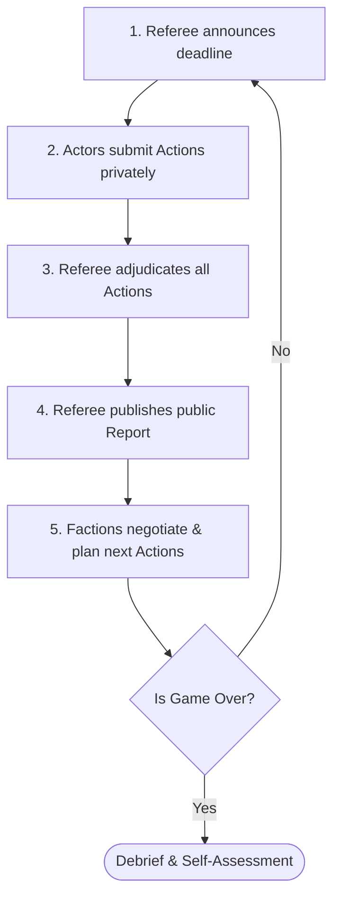
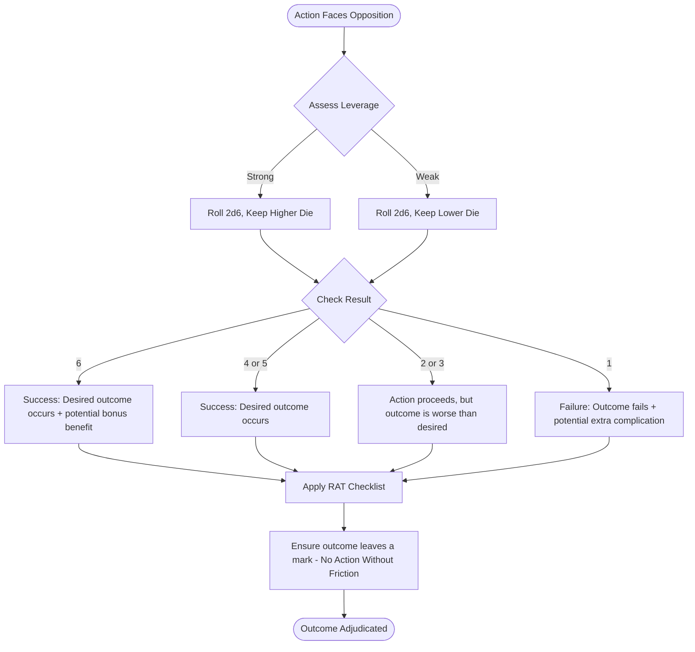
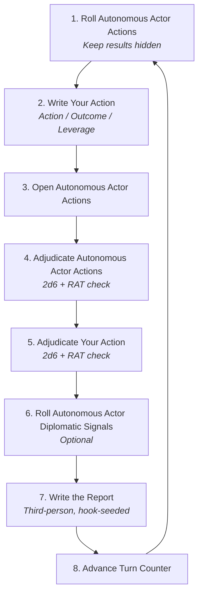

This document contains a generic, setting-neutral rules framework derived from the design principles documented in the Open Strategy Game Handbook. It can be used as written, adapted, or built upon to create published OSG scenarios and variants.

## Part I: Core Concepts

### What This Game Is

You play a **faction**. Not a character, not a hero: a collective entity with interests, leverage, and objectives. The game is a shared crisis: a structural problem that every faction must respond to, but that no faction can solve alone, and that no faction will solve in the same way.

The game ends after a fixed number of turns. Each player then assesses whether they achieved their objectives. The debrief that follows is part of the game.

**Two things are true simultaneously:**

- The goal of the game is to achieve your objectives.
- The point of the game is to create a credible narrative.

Play to win. Play to find out. Both at once.

## Part II: Roles

### The Referee

The Referee adjudicates all actions, writes the public Report each turn, and maintains the internal consistency of the fiction. The Referee is not a Game Master; they do not author a story or protect a narrative outcome. They adjudicate, report, and stay consistent.

The Referee operates by **Benevolent Dictatorship**: full authority, no public argument from other players before ruling. This keeps the game moving and protects interesting outcomes from being argued away by the loudest voice at the table.

### Actors

Each Actor controls one faction. A faction is defined by three things:

1. **What it is**: its fundamental nature and identity in the world
2. **What it wants**: its core drive and why it wants it
3. **What makes it unlike others**: the specific leverage type or constraint that distinguishes it from every other faction in this game

If you cannot write these three bullets distinctly for a faction, it is not yet designed.

### Extras (Overflow Players)

When player count exceeds the Actor roster, Extras participate through one of these portable roles:

**Consultant.** One question to the Referee per turn. No action submitted. The question is open-ended; the Referee answers at their discretion, fully, partially, or not at all if it would reveal another Actor's private information. The constraint is the mechanism: one question forces a choice about what you actually need to know.

**Team Actor.** Two to three players share one Actor, deliberate internally, and submit a single action. Maximum three players per team. The deliberation moderates extreme positions and models how real collective entities behave. Keep team Actors to roles with no internal information asymmetry; a role with secrets that must stay secret within the team should be played solo.

**Scenario-Specific Roles.** Some scenarios embed participation structures into the fiction itself (an electorate that votes, a mob whose actions are randomly selected, a council that deliberates). These are not portable; they must be designed for their specific scenario and explained to participants before play.

## Part III: The Turn



### Action Format

Every action follows this three-part structure, submitted privately to the Referee:

> **Actor:** *(your faction)* **Turn:** *(turn number)*
>
> **Action:** What specifically are you doing?
>
> **Outcome:** What result do you want from this action?
>
> **Leverage:** Why is this action likely to produce that outcome? Ground it in established fiction: resources, relationships, position, prior actions.

The three parts do distinct work. **Action** commits you to a specific course of conduct, not a vague intention. **Outcome** separates what you're doing from what you want; the Referee adjudicates the outcome, not just the action. **Leverage** requires you to think about why your plan should work before the Referee has to assess it.

### One Action Per Turn

Each Actor submits exactly one action per turn. Not two bundled into one. If a submission is clearly two actions, the Referee returns it and asks which one matters more. The choice of what to prioritize is part of the game.

### Talking Is Free

Actors may communicate with each other at any time about anything. Negotiating an alliance, sharing intelligence, issuing a warning: none of these cost your turn. The limit is what you actually *do*. Talking about building a fleet is free. Building the fleet costs a turn.

### Private Submission

Actions are sent directly to the Referee, not posted publicly. This prevents reactive play from dominating over genuine strategy, allows the Referee to adjudicate the full turn before any outcomes are public, and keeps genuinely covert operations covert until the Referee decides what to reveal.

### Timing

**Asynchronous play:** 48-hour submission window from Report publication is a practical default.

**Missed deadline:** Either a one-turn pass (the faction takes no action) or a Referee-authored holding action: something plausible and low-stakes that keeps the faction present in the Report. Declare the policy before the game begins.

**Live play:** The single-action discipline and private submission rules still apply; the timing window compresses from days to minutes.

## Part IV: Adjudication

### The Core Assessment

When an action faces opposition, the Referee asks one qualitative question: *given what is established in the fiction, does this Actor have enough of an advantage that success is more likely than not?*

**Strong leverage:** the Actor has established resources, relationships, position, or prior actions that tip the balance in their favor.

**Weak leverage:** the action is plausible, but without a strong basis for expecting success.

The Referee is not scoring a debate. Strong or weak is a judgment, not a calculation.

### The Dice Mechanic

When an action faces opposition, roll **2d6**.

| Leverage | Keep               |
| :------- | :----------------- |
| Strong   | The **higher** die |
| Weak     | The **lower** die  |

| Result  | Outcome                                                    |
| :------ | :--------------------------------------------------------- |
| **6**   | Success: something especially good may also occur          |
| **4–5** | The desired outcome occurs                                 |
| **2–3** | The action proceeds, but the outcome is worse than desired |
| **1**   | Failure: something especially bad may also occur           |



### Unopposed Actions

When no other faction is directly opposing the action and the fiction raises no inherent obstacle, the action is Unopposed: the Actor gets their desired outcome. Unopposed does not mean free. The Referee still determines how the outcome lands and writes it into the Report as a fact other Actors now have to contend with.

### Force of Nature

When both dice show the same number, the Referee *may* introduce a **Force of Nature**: a chaotic event originating outside any player's influence. This is a prompt, not a requirement. Use it only when a good Force of Nature is available: unpredictable but traceable, emerging from threads already present in the fiction, creating problems for everyone rather than punishing one Actor. Once or twice per game.

### The RAT Checklist

Before writing any outcome, check it against three criteria:

**Reasonable.** Is this outcome proportionate? Does it feel like something that would actually happen given what the fiction has established?

**Actionable.** Does this outcome create hooks for future play? Does it leave at least one other Actor something to respond to, investigate, or exploit?

**Traceable.** Can you point to earlier events in the fiction that led here? Does this feel like a consequence of prior decisions, not something that came from nowhere?

If an outcome fails any of these tests, rewrite it before publishing the Report.

### No Action Without Friction

Every outcome, successful or not, leaves a mark on the world. A success that is wholly positive with no complicating consequence is not yet a complete outcome: ask who notices, what becomes harder, what new possibility or problem it creates.

The distinction between **friction** and **hurdles**: a hurdle blocks an action (*"you can't do this"*). Friction complicates it (*"you can do this, but it costs something"*). Hurdles are referee veto by another name. Replace "no" with "yes, but."

A failure that produces three hooks is better for the game than a success that produces one. When writing a failure, ask: what did the attempt reveal? Who noticed? What is now in motion that wasn't before?

## Part V: The Report

The Report does two things simultaneously: it **chronicles** what happened, and it **re-seeds** the game for the next turn.

**Style:** Write in the voice of a news roundup. Brief, factual, third-person. State outcomes as facts about the world, not explanations of adjudication reasoning. The Referee's reasoning belongs in private feedback to the Actor, not in the public record.

**Length:** Short. A Report with one paragraph per action, plus a closing observation, is better than a three-page narrative that buries the hooks.

### Hook-Seeding

After each outcome, ask: *what does this create for other players?* Write at least one thing another Actor has a reason to respond to. Unexplained details are better hooks than explained ones: they invite interpretation and action rather than just acknowledgment.

Fill the Report with hooks the way you fill the initial Brief with problems.

### Private Outcomes and Traceable Crumbs

For every private outcome (a covert operation, a secret deal), plant a **traceable crumb** in the public Report: a proper name, a meeting observed, a shipment delayed; something specific enough for a careful reader to notice, not specific enough to give away the secret.

When the private outcome becomes relevant later, the crumb makes the revelation feel earned rather than arbitrary.

## Part VI: The Debrief

Run the debrief. Always.

Before the debrief, the Referee publishes a **closing frame**: either a state-of-world table (faction-by-faction summary of final position, most significant achievement, most significant loss) or a brief narrative epilogue. The frame marks the transition from playing the game to talking about it.

### Debrief Sequence

1. **In-role closing** *(1–2 minutes)*. Each player says one or two sentences in the voice of their faction. Not a recap: a farewell. One or two sentences, around the table.
2. **Self-assessment reveal** *(no discussion yet)*. Each player states, for each objective: did they achieve it, and why or why not? One player at a time, uninterrupted. This is disclosure, not argument.
3. **Table response**. Open discussion. Players can agree, disagree, contest, or add context to anyone's self-assessment. The Referee participates as another voice, not as arbiter. There is no official verdict.
4. **Out-of-role reflection**. What were you actually trying to do? Where did your strategy shift? What turn surprised you most? What would you do differently? This phase is about the experience of play, not the narrative outcomes.
5. **Referee reflection**. What did the Referee not anticipate? What worked better than expected? What would they change about the scenario design? This is not a post-mortem apology: it is honest accounting.

The Referee does not arbitrate self-assessment disputes. Two players disagreeing about whether an objective was achieved is itself part of the outcome. Let both versions stand.

## Part VII: Scenario Design

### The Seven Steps

Design proceeds in this order. Each step produces what the next step requires.

| Step             | Output                                           |
| :--------------- | :----------------------------------------------- |
| 1. **Problem**   | One-sentence crisis statement                    |
| 2. **Actors**    | 5–8 differentiated factions                      |
| 3. **Briefs**    | Objectives + Position for each Actor             |
| 4. **Map**       | Argued playing field                             |
| 5. **Bonuses**   | Spendable leverage asymmetry *(optional)*        |
| 6. **NPAs**      | Referee-controlled faction pressure *(optional)* |
| 7. **Turn Zero** | Shared fictional assumptions before Turn 1       |

```mermaid
flowchart LR
    Step1[1. Problem<br><i>One-sentence crisis</i>] --> Step2[2. Actors<br><i>5-8 factions</i>]
    Step2 --> Step3[3. Briefs<br><i>Objectives + Position</i>]
    Step3 --> Step4[4. Map<br><i>Argued playing field</i>]
    Step4 --> Step5[5. Bonuses<br><i>Leverage asymmetry (opt)</i>]
    Step5 --> Step6[6. NPAs<br><i>Referee pressure (opt)</i>]
    Step6 --> Step7[7. Turn Zero<br><i>Shared assumptions</i>]
```

**Design minimum: Problem + Actors + Briefs.** Map is strongly recommended. Bonuses and NPAs are optional.

### The Problem Statement

One sentence. Declarative. Names what has changed, implies competing interests without specifying them, and refuses to point at a correct answer.

**A generative problem has three properties:**

- **Multiple plausible responses**: at least four or five distinct strategic orientations feel reasonable (enforcement, accommodation, exploitation, neutrality, escalation, deflection)
- **No single correct answer**: the problem is structurally contested, not just politically contested
- **Inherent friction between at least two Actors**: before anyone makes a single decision

**What a problem statement is not:** a scenario description, a list of objectives, a question. It is a starting condition, not instructions.

**Three-Angles Test:** Can you argue for three different responses from three different fictional positions, none obviously correct? If not, the problem is under- or over-determined. Revise.

### Actors

**5–8 Actors.** Below five, no interesting alliance dynamics. Above eight, the Report becomes unmanageable and player cognitive load exceeds capacity.

Factions differ by **leverage type**, not power level. Primary leverage types:

- **Military**: direct force or credible threat; expensive, fast, politically costly
- **Economic**: financial resources, trade control; slow, persistent, creates dependency
- **Geographic**: territory, chokepoints, transit routes; static but often decisive
- **Informational**: intelligence, secrets, communications; hard to assess from outside, enables surprise

Give each faction a clear primary leverage type and a secondary type that creates tradeoffs.

**Specificity principle:** Vague positions make vague arguments. "Has resources" is not a position. "Controls the only two deep-water ports" is a position. When writing a position bullet, ask: could two players interpret this in ways that lead to different leverage arguments? If yes, it's too vague.

**Typecasting traps to avoid:**

- *The pure military faction*: no interesting decisions when the answer to everything is "deploy more force." Fix: give it a significant non-military vulnerability.
- *The pure diplomat*: no stakes when the faction can never be directly threatened. Fix: give it interests that require outcomes it cannot achieve through negotiation alone.
- *The pure wildcard*: no coherent objectives means nothing to self-assess. Fix: every faction needs objectives that conflict with at least two others.

### Briefs

Each Brief contains two mandatory fields:

**Objectives.** Two paired objectives: one **short-term** (achievable within the game's turn count) and one **long-term** (groundwork laid during the game; full achievement may be beyond its scope). The pair creates tension: chasing the short-term may undermine the long-term, and vice versa.

Apply the **Pithy Objectives Test**: add "!" to any objective and read it aloud. If it reads like something a faction leader would say with conviction, it passes. If it reads like a policy document, it fails: rewrite with more specificity.

**Position.** What is especially significant about this faction relative to others. Not an inventory; only what matters for play. Include specific assets, specific vulnerabilities, key relationships, and geographic or positional constraints. Exclude things true of every faction and background information that doesn't affect play decisions.

**Public vs. Private.** Each Brief has a public component (what all Actors know about this faction) and a private component (what only this Actor knows: secret objectives, private assets, hidden intelligence).

> **Brief Template**
>
> *General Brief: distributed to all players*
>
> **The Problem:** *(one sentence)*
> **The World:** *(broad strokes, shared context)*
> **The Actors:** *(one public sentence per faction)*
> **Structure:** Each Actor submits one Action per turn in the format Action / Outcome / Leverage. The game ends after *(X)* turns. Objectives are self-assessed at game end.
> **Expectations:** The goal of the game is to achieve your objectives. The point of the game is to create a credible narrative.
>
> ---
> *Private Brief: this Actor only*
>
> **Faction Name:**
> **Objectives:**
>
> - Short-term:
> - Long-term:
>
> **Position:**
> -
>
> -
> -
>
> **Special Abilities** *(if using bonuses)*:

| Name | Uses | Description |
| ---- | ---- | ----------- |
|      |      |             |

### The Map

The map is an editorial statement about which parts of the world are in play, not a neutral representation. Map design starts with: *what should players be arguing about?*

**Geographic maps** support arguments about movement, terrain, chokepoints, and supply. **Schematic maps** support arguments about influence, alliance, and informational control. Match the map type to your faction leverage types.

**What belongs on the map:**

- Contested zones: locations multiple Actors have reason to control
- Faction starting positions: visually distinct, asymmetrically placed
- Named arguable locations: any location that will appear in actions and Reports must be named and locatable

**Minimum viable map:** 3–5 locations and 3–5 connection lines. Sufficient to run a game. Readable at a glance by someone who has never seen it before.

**Minimum components:**

- One token per faction (distinctive color or shape)
- Markers for contested zone control
- Optional: named asset markers for specific established resources

### Spendable Bonuses *(Optional)*

Bonuses are named, one-use assets tied to a faction's starting position that can be spent to strengthen leverage in a specific action. They add asymmetry beyond faction identity.

**Name bonuses narratively**, not mechanically. *Io Dust ×3* is better than *Military Advantage Token ×3*. A narrative name implies a context: when and how it can be used, which makes adjudication cleaner.

**Traits vs. Bonuses:** A **trait** is a persistent characteristic that strengthens leverage whenever contextually relevant and never diminishes (*"largest standing army on the peninsula"*). A **bonus** is spent: one-use, gone after deployment, creating strategic decisions about timing.

**Scoping bonuses:** A bonus should shift leverage from weak to strong, not guarantee success regardless of other factors. It must be contextually bounded; the narrative name indicates its scope.

**Bonus design checklist:**

- Every faction has at least one named bonus
- All bonuses are narratively named
- No bonus guarantees success regardless of other leverage
- No faction has more than twice the high-value bonuses of any other
- Multi-use vs. single-use allocations match the intended strategic style of each faction

### Non-Player Actors (NPAs) *(Optional)*

An NPA is a faction the Referee controls. It has a Brief, submits actions, and appears in the Report exactly as any Actor does; players do not need to know it is Referee-controlled.

**Use NPAs when** a force exists in the fiction with plausible independent interests, no player is available to control it, and it matters enough to appear in Reports.

**Don't use NPAs when** the fiction already generates sufficient pressure from player actions, the NPA would crowd out player agency, or the Referee is already at capacity.

**NPA Brief (minimal):**

- One objective: what does it want from the game situation?
- One position item: what is most significant about its current state?
- One leverage type: how does it act?
- Optional: a behavior rule (*"acts defensively unless directly threatened"*) and a turn-limit rule

**Referee-controlled vs. Random-controlled:** Use Referee control for NPAs with coherent rational interests. Use random control (dice table, or Extras proposing actions with one selected randomly) for NPAs that are chaotic, emergent, or mob-like by nature.

### Turn Zero

Turn Zero runs before the first formal turn. No actions are adjudicated; no outcomes produced; the game clock does not advance. It is a structured Q\&A that surfaces false assumptions before they produce mid-game disputes.

**Three categories of questions:**

- Fictional world assumptions: details not explicit in the Brief that turn out to matter for strategy
- Edge cases in the problem statement: interpretive questions about the starting condition whose answers change what early actions are viable
- Rules questions: action format, leverage assessment, private submission, bonus usage

Actors submit questions privately or in a shared channel. The Referee publishes a compiled Turn Zero FAQ visible to all players. Turn Zero has a deadline, the same as a regular turn.

**The Referee prepares:**

- A private world-assumptions cheat-sheet (answers to likely questions, drafted in advance for consistency)
- An intentionally ambiguous list (details the Referee has decided *not* to settle: ambiguity whose resolution should come from play, not pre-game answers)
- Clear answers to common rules questions

**Assign roles before players read the scenario.** Players who receive faction assignment first read their Brief as players, looking for what their faction can do. Players who read first and assign afterward read as analysts. The first posture produces investment in the role; the second produces detached evaluation.

**Typecasting guidance when assigning roles:**

- Assertive, confrontational players: factions with overt pressure leverage (military powers, creditors)
- Collaborative, negotiation-oriented players: factions that multiply leverage through alliance (brokers, neutral parties)
- Detail-oriented, systematic players: factions that accumulate positional advantage through information or procedure
- Improvisational players: factions with deliberately underspecified briefs

## Part VIII: Referee Checklist

### Pre-Game Scenario Review

**Problem:**

- Does the problem statement fit in one sentence?
- Does it name what has changed, imply competing interests, and refuse a correct answer?
- Does it pass the Three-Angles Test (three viable responses, none obviously superior)?

**Actors:**

- Are there 5–8 Actors (or Extras planned for overflow)?
- Can you write three distinct bullets for each faction?
- Do factions have different leverage types, not just different power levels?
- Does every faction have objectives that conflict with at least two others?
- Have you avoided the pure-military, pure-diplomat, and pure-wildcard traps?

**Briefs:**

- Does every Actor have two paired objectives (short/long-term)?
- Do objectives pass the Pithy Test?
- Does every position field describe only what is especially significant relative to other Actors?
- Does every Actor have at least one named bonus (if using bonuses)?

**Map:**

- Are there 3–5 contested zones with names?
- Are faction starting positions spread asymmetrically?
- Is the map readable at a glance?

### Per-Turn Adjudication Checklist

**Before adjudicating:**

- Is every action in complete format (Action / Outcome / Leverage)?
- Is each action a single course of conduct, not two bundled?
- Is leverage grounded in established fiction, not just assertion?

**During adjudication:**

- Is this action Unopposed or opposed?
- If opposed: is leverage Strong or Weak?
- Does each outcome pass the RAT check (Reasonable / Actionable / Traceable)?
- Is every outcome leaving a mark on the world (No Action Without Friction)?
- Are you applying friction, not hurdles?

**After writing the Report:**

- Does every outcome have at least one hook for another Actor?
- Is every private outcome accompanied by a traceable crumb in the public Report?
- Is the Report written in news-roundup style, not adjudication explanation?

## Part IX: Solo Mode

You play one Actor. All other factions are **Autonomous Actors (AAs)**, driven by written behavior rules and random tables, not referee judgment. You are simultaneously the player and the referee. The core loop (declare an action, adjudicate it honestly, write a report, advance the world) remains intact.

### Setup

Follow the standard design workflow from Part VII, with these adjustments:

1. Write a one-sentence **Problem Statement**
2. Create **3–5 Actors** total (including yourself) with asymmetric leverage types
3. Write a **Brief** for your Actor (two paired objectives + position)
4. Write a **minimal AA Brief** for each other faction (see below)
5. Sketch a **Map** with 3–5 named contested locations
6. Assign yourself at least one named **Spendable Bonus**

A game of 3 Actors (you + 2 AAs) over 6 turns is a solid first run.

#### AA Briefs

Each Autonomous Actor needs only four things:

| Field             | Content                                                  |
| :---------------- | :------------------------------------------------------- |
| **Objective**     | One sentence: what this faction wants most               |
| **Position**      | One specific asset or vulnerability that matters         |
| **Leverage Type** | Military / Economic / Geographic / Informational         |
| **Behavior Rule** | A standing instruction for how it acts (see table below) |

**AA Behavior Rules (d6):** Roll once per AA at setup, or choose:

| d6 | Behavior Rule                                                                                                           |
| :- | :---------------------------------------------------------------------------------------------------------------------- |
| 1  | *Consolidator*: acts to secure and hold what it already controls; only targets others if directly threatened           |
| 2  | *Aggressor*: each turn acts toward its objective by the most direct available means; does not negotiate                |
| 3  | *Opportunist*: targets whichever Actor is currently weakest or most exposed in the fiction                             |
| 4  | *Balancer*: acts against whoever holds the most visible power or influence this turn                                   |
| 5  | *Reactor*: does nothing until acted upon; responds to the last action that affected it                                 |
| 6  | *Schemer*: alternates between one turn of visible action and one turn of consolidation (odd = act, even = consolidate) |

### The Turn

#### Step 1: Generate AA Actions

Before writing your own action, determine what each AA does this turn. This order matters: **you commit to your action without knowing AA outcomes, just as in a standard OSG**.

For each AA, roll **d6** on its **Action Table** (written at scenario creation; see below) and note the result. Do not adjudicate yet.

#### Step 2: Declare Your Action

Write your action in the standard format from Part III. Commit to it in writing before opening the AA results.

#### Step 3: Adjudicate All Actions

Open the AA results. Adjudicate AA actions first, then your own. Apply the dice mechanic from Part IV honestly. Apply the RAT check (Part IV) to every outcome before writing it.

#### Step 4: Write the Report

Write a brief, third-person, factual report covering every action's outcome. Style: news roundup. End with one open observation that no single faction owns.

After writing each outcome, ask: *does this put something in front of me or an AA that changes the next turn?* If no: rewrite.

### The AA Action Table

Write this at scenario creation for each AA. It is a d6 table of 6 plausible actions consistent with that faction's objective, leverage type, and behavior rule. Actions should vary in target and method but stay within the faction's identity.

**Example: "The Iron Compact"** *(objective: control the central city; leverage: military; behavior: Aggressor)*:

| d6 | Action                                                          |
| :- | :-------------------------------------------------------------- |
| 1  | Advance a garrison unit toward the nearest contested zone       |
| 2  | Issue a public ultimatum demanding another faction's withdrawal |
| 3  | Blockade a supply route between two other Actors                |
| 4  | Attempt to suborn a local official in the contested zone        |
| 5  | Request formal recognition from a neutral party                 |
| 6  | Consolidate current position; fortify and resupply              |

**Veto rule:** if the rolled action is fictionally incoherent given the current game state (the location no longer exists, the target has already conceded, etc.), reroll once. If the reroll is also incoherent, apply the faction's behavior rule directly to generate an action from scratch.

### Leverage Assessment

The greatest risk in solo play is unconscious bias: grading your own leverage too generously. Apply this checklist before calling leverage Strong:

- [ ] Is the resource or relationship **explicitly established** in prior fiction, not assumed?
- [ ] Has a prior action **created the conditions** for this one to succeed?
- [ ] Would a neutral reader of the report agree this faction has the advantage?

If you answer No to any of these, call it **Weak**.

### AA Diplomatic Signals *(Optional)*

Since AAs cannot negotiate, this procedure partially replaces the social layer. Once per turn, **after reading AA action results but before writing the report**, roll d6 for each AA:

| d6  | Signal                                                                                                      |
| :-- | :---------------------------------------------------------------------------------------------------------- |
| 1–2 | No signal                                                                                                   |
| 3   | The AA's action this turn was implicitly directed *away* from you; write one crumb suggesting restraint    |
| 4   | The AA's action this turn creates a condition you could exploit if you act toward it next turn              |
| 5   | The AA has overextended; its position is now vulnerable in a specific way (you determine what)             |
| 6   | The AA acts in a way that incidentally benefits you; write it into the report as an unintended consequence |

This is not negotiation. It is the world signaling opportunities, the same way a good report seeds hooks for all Actors.

### Turn Structure Summary

```
1. Roll AA Action Tables → note results, do not read yet
2. Write your Action (Action / Outcome / Leverage)
3. Open AA results
4. Adjudicate AA actions (2d6, RAT check)
5. Adjudicate your action (2d6, RAT check)
6. Roll AA Diplomatic Signals (optional)
7. Write the Report (third-person, factual, hook-seeded)
8. Advance the turn counter
```



### Game Length

| Turns | Feel                                                 |
| :---- | :--------------------------------------------------- |
| 4     | Sharp, fast: one strategic arc                      |
| 6     | Standard: alliances form and break                  |
| 8     | Full campaign: long-term objectives come into reach |

The game ends at the stated turn count. No extensions.

### The Debrief

Solo play changes the debrief (Part VI) into a **written self-assessment**. After the final report, write:

1. **Did you achieve your short-term objective?** Why or why not.
2. **Did you achieve your long-term objective, or lay groundwork toward it?**
3. **What turn surprised you most?** What produced the surprise: AA behavior, a Force of Nature, or your own action's consequences?
4. **What would you design differently** in the scenario: the problem statement, an AA behavior rule, a leverage asymmetry?

The debrief is also design feedback. A solo game that produced no surprises has AA tables that were too predictable. A game that felt incoherent has a problem statement that didn't generate distinct enough competing interests.

## Glossary

**AA (Autonomous Actor)**: A faction driven by a Behavior Rule and a random Action Table in solo play, replacing an absent human player. Has a minimal Brief; does not negotiate.

**AA Action Table**: A d6 table of six plausible actions written at scenario creation for each Autonomous Actor. Rolled at the start of each solo turn.

**Behavior Rule**: A standing instruction governing how an Autonomous Actor acts each turn (Consolidator, Aggressor, Opportunist, Balancer, Reactor, Schemer).

**Diplomatic Signal**: An optional solo procedure rolled once per turn per AA after adjudication. Signals opportunities, vulnerabilities, or unintended consequences without replacing negotiation.

**Action**: The specific course of conduct an Actor pursues this turn. Submitted privately in the format Action / Outcome / Leverage. Narrower than a general claim about the world: it describes what you *do*.

**Actor**: A faction controlled by a single player (or team, via Team Actor). Equivalent to "Player/Faction" in traditional Matrix Game literature; Actor foregrounds the role-play dimension.

**Benevolent Dictatorship**: The OSG adjudication model: one Referee, full authority, no public argument before ruling.

**Bonus**: A named, spendable one-use asset tied to a faction's starting position. Spent to shift leverage from weak to strong in a specific action. Distinguished from a Trait (persistent, never diminishes).

**Brief**: The document each Actor receives before the game: public information (shared with all) and private information (this Actor only). Contains Objectives and Position.

**Consultant**: An Extras sub-role: one question to the Referee per turn, no action submitted.

**Force of Nature**: A chaotic external event the Referee may introduce when both dice show the same number. A prompt, not a requirement.

**Friction**: The principle that every outcome leaves a mark. Complicates actions rather than blocking them. Opposed to Hurdles.

**Hurdle**: An adjudication error: blocking an action outright rather than complicating it. Replace "no" with "yes, but."

**Leverage**: The reasons an action is likely to succeed: resources, relationships, positioning, established fiction. Graded as Strong or Weak relative to opposition.

**NPA (Non-Player Actor)**: A faction the Referee controls. Has a Brief, acts each turn, appears in Reports.

**Objectives**: What an Actor is trying to accomplish. Two paired objectives per Actor: short-term and long-term. Self-assessed at game end.

**Outcome**: The result the Actor wants from their Action. Declared before adjudication; the Referee determines whether it occurs.

**Position**: An Actor's starting configuration as it is especially significant relative to other Actors. Not an inventory.

**RAT**: Adjudication checklist. **R**easonable / **A**ctionable / **T**raceable.

**Referee**: Adjudicates actions, writes Reports, maintains consistency. Not a Game Master: does not author fiction or protect a narrative agenda.

**Report**: The public document the Referee produces at the end of each turn: outcomes chronicled, hooks seeded.

**Talk-Back / Debrief**: The post-game conversation in which Actors reveal Objectives, self-assess, and reconstruct what happened. Not optional.

**Team Actor**: An Extras sub-role in which 2–3 players share one Actor.

**Trait**: A persistent leverage characteristic (e.g., "largest standing army"). Always available when contextually relevant; never diminished by use. Distinguished from a Bonus.

**Turn**: One full play cycle: Actions submitted, adjudicated, Report published.

**Turn Zero**: A pre-game Q\&A session before Turn 1. No actions; produces shared fictional and procedural assumptions.

## Credits & License

© 2026 Roberto Bisceglie

The Open Strategy Game format was defined by Chris McDowall, originating in the Matrix Game tradition established by Chris Engle and Tom Mouat. This document draws on the practice and analysis of Chris McDowall and Sam Doebler.

This work is licensed under Creative Commons Attribution-ShareAlike 4.0 International. To view a copy of this license, visit https://creativecommons.org/licenses/by-sa/4.0/

